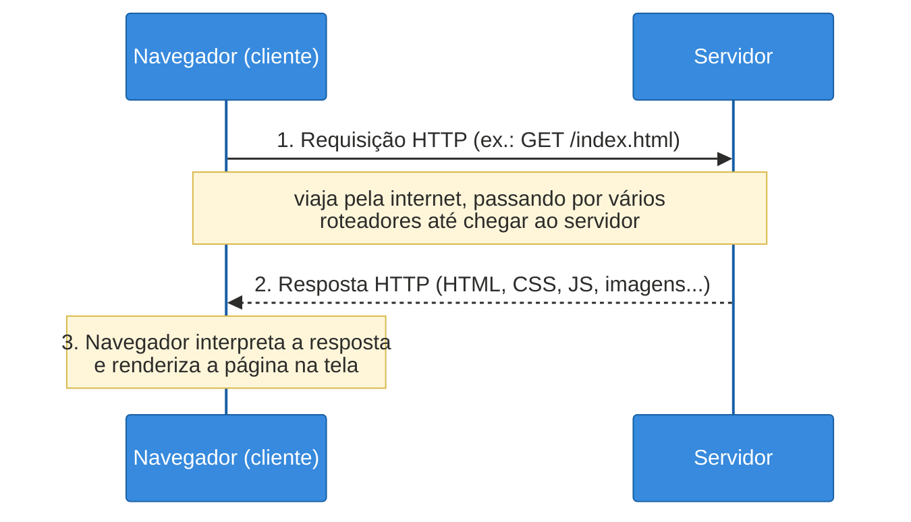
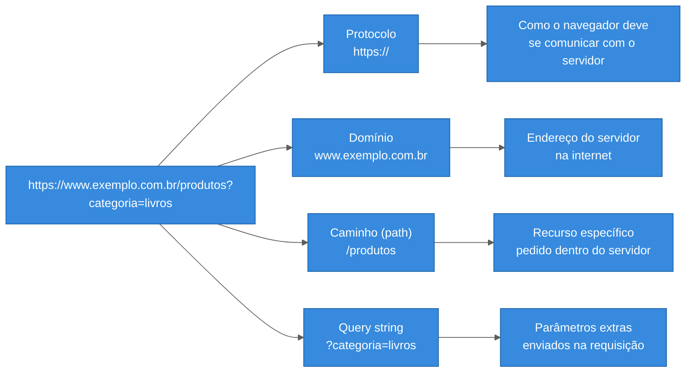
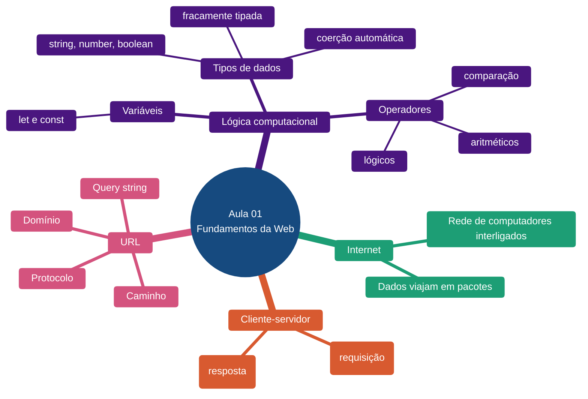

# Aula 01 — Fundamentos da Web: Internet, Cliente-Servidor e Lógica Computacional

**Disciplina:** Desenvolvimento Web
**Duração:** 3h
**Etapa da trilha:** Etapa 1 — Fundamentos da Web (Lógica computacional + HTML)

**Objetivos de aprendizagem:**

- Explicar como a internet conecta um navegador a um servidor e o que acontece quando uma página é carregada.
- Identificar as partes de uma URL e o papel de cada uma.
- Declarar variáveis, reconhecer os tipos de dados básicos e usar operadores em JavaScript, testando tudo no console do navegador.

---

## 1. Contextualização

Você já usou um navegador milhares de vezes: digitou um endereço, apertou Enter e uma página apareceu. Mas o que realmente acontece nesse intervalo de tempo, entre apertar Enter e a página surgir na tela?

Esta é a primeira aula da disciplina de Desenvolvimento Web. Antes de escrever qualquer linha de HTML, CSS ou JavaScript, precisamos entender o "cenário" onde tudo isso vai rodar: como a internet funciona, o que é um servidor, o que é um navegador e como eles conversam entre si. Esse entendimento vai justificar praticamente tudo que faremos daqui para frente — inclusive por que, mais adiante no curso, vamos falar de requisições HTTP, APIs e comunicação entre aplicações.

Na segunda metade da aula, damos o primeiro passo dentro da própria linguagem que vamos usar bastante: JavaScript. Vamos revisar (ou aprender, se for a primeira vez) os blocos mais básicos de qualquer programa: variáveis, tipos de dados e operadores.

---

## 2. Conteúdo teórico incremental

### 2.1 O que é a internet

A internet é uma rede gigante de computadores conectados entre si, capazes de trocar informação. Quando você acessa um site, seus dados não viajam "direto" — eles são quebrados em pequenos pacotes que passam por vários roteadores até chegar ao destino, e o processo se repete no caminho de volta.

Não precisamos entender os detalhes de roteamento para programar para a web.

> [!NOTE]
> Toda comunicação na web acontece entre pelo menos duas máquinas, através de uma rede.

### 2.2 Cliente e servidor

Esse é o modelo mais importante da aula:

- **Cliente** — geralmente o navegador (Chrome, Firefox, Edge...) rodando no computador ou celular do usuário. É quem **pede** algo.
- **Servidor** — um computador (normalmente remoto, em um data center) que fica esperando pedidos e **responde** a eles, geralmente devolvendo HTML, CSS, JavaScript, imagens ou dados.

Esse padrão de "pedido → resposta" se chama modelo **cliente-servidor**.

> [!IMPORTANT]
> O modelo cliente-servidor é a base de praticamente tudo que veremos no curso — inclusive quando, mais para frente, formos consumir APIs. Entender bem essa relação de "quem pede" e "quem responde" agora vai facilitar todo o restante da disciplina.

### 2.3 O navegador

O navegador é um programa com várias responsabilidades:

1. Enviar a requisição para o servidor certo.
2. Receber a resposta (HTML, CSS, JS...).
3. Interpretar esse conteúdo e desenhar (renderizar) a página na tela.
4. Executar o JavaScript da página, permitindo interatividade.

Ele também tem ferramentas para desenvolvedores (**DevTools**) que vamos usar bastante ao longo do curso — inclusive hoje, para testar código JavaScript diretamente no console.

> [!TIP]
> Para abrir o DevTools em qualquer navegador, pressione `F12` ou clique com o botão direito na página e selecione "Inspecionar". A aba **Console** é onde vamos digitar e testar código JavaScript nesta aula.

### 2.4 O que é uma URL

URL (*Uniform Resource Locator*) é o "endereço" de um recurso na web. Toda URL tem partes bem definidas:

```
https://www.exemplo.com.br/produtos?categoria=livros
```

- **Protocolo** (`https://`) — define as regras de comunicação entre cliente e servidor.
- **Domínio** (`www.exemplo.com.br`) — identifica o servidor na internet.
- **Caminho** (`/produtos`) — indica qual recurso específico está sendo pedido dentro daquele servidor.
- **Query string** (`?categoria=livros`) — parâmetros extras enviados junto com o pedido.

---

## 3. Diagramas

### 3.1 Fluxo cliente-servidor



### 3.2 Anatomia de uma URL



---

## 4. Exemplo de código

Abra o console do navegador (veja a dica na seção anterior). Todo o código abaixo pode ser digitado e testado ali (ou em um arquivo `.js` rodado com Node, se preferir).

### Primeiro contato: Hello, World!

Antes de qualquer coisa, vamos escrever a linha mais tradicional de todo curso de programação — o famoso "Hello, World!". O objetivo aqui não é aprender um conceito novo, e sim confirmar que você já sabe abrir o console e executar uma linha de JavaScript nele.

```js
console.log("Hello, World!");
```

Digite essa linha no console e pressione Enter. Você deve ver o texto `Hello, World!` aparecer logo abaixo.

> [!NOTE]
> `console.log(...)` exibe qualquer valor entre os parênteses. Aqui exibimos um texto (string), mas mais adiante veremos que também dá para exibir números, booleans e resultados de cálculos.

Com o console testado e funcionando, vamos para um exemplo um pouco mais completo.

### Antes de rodar

Leia o código abaixo com atenção e responda: **o que você acha que vai aparecer no console, linha por linha?**

```js
// Etapa 1: declarar variáveis com tipos diferentes
let nomeAluno = "Maria";
let idade = 20;
let matriculado = true;

// Etapa 2: usar operadores para gerar novos valores
let idadeDaqui5Anos = idade + 5;
let maiorDeIdade = idade >= 18;

// Etapa 3: exibir os resultados
console.log(nomeAluno);
console.log(typeof nomeAluno);
console.log(idadeDaqui5Anos);
console.log(maiorDeIdade);
```

### Execute e confira

Execute o código no console. O resultado esperado é:

```
Maria
string
25
true
```

### Entendendo o código linha a linha

- **Etapa 1 — declarar variáveis com tipos diferentes**
  - `let nomeAluno = "Maria";` cria uma variável do tipo **string** (texto), sempre entre aspas.
  - `let idade = 20;` cria uma variável do tipo **number** (número), sem aspas.
  - `let matriculado = true;` cria uma variável do tipo **boolean** (verdadeiro/falso).
  - `let` é a forma mais comum de declarar uma variável cujo valor pode mudar depois. Existe também `const`, usado quando o valor **não** deve ser reatribuído.

> [!TIP]
> Prefira `const` sempre que o valor da variável não for mudar depois de criada. Use `let` apenas quando você já sabe que vai reatribuir o valor mais adiante. Essa escolha deixa o código mais fácil de entender, pois quem lê sabe de antemão o que pode ou não mudar.

> [!CAUTION]
> JavaScript é uma linguagem **fracamente tipada** (também chamada de *dinamicamente tipada*): você não declara o tipo da variável explicitamente, e uma variável criada com `let` pode passar a guardar um valor de outro tipo depois, sem erro:
> ```js
> let valor = 10;    // number
> valor = "dez";     // agora é string, e o JavaScript aceita numa boa
> ```
> Isso também faz o JavaScript aplicar **coerção automática de tipos**: converter um valor de um tipo para outro sozinho, sem avisar, quando a operação exige isso. Um exemplo clássico:
> ```js
> console.log("5" + 3);  // "53" — o número vira texto, e o + concatena
> console.log("5" - 3);  // 2    — o texto vira número, pois o - só existe entre números
> ```
> Misturar tipos diferentes numa operação nem sempre dá erro — às vezes dá um resultado que engana quem não está esperando essa conversão automática.

- **Etapa 2 — usar operadores para gerar novos valores**
  - `idade + 5` usa o **operador aritmético** `+` para somar. O resultado (`25`) é guardado em uma nova variável.
  - `idade >= 18` usa o **operador de comparação** `>=` ("maior ou igual"), que sempre devolve um boolean (`true` ou `false`).
- **Etapa 3 — exibir os resultados**
  - `console.log(...)` imprime qualquer valor no console — é a principal ferramenta para "ver o que está acontecendo" dentro do código.
  - `typeof nomeAluno` devolve o tipo da variável como texto (`"string"`), útil para conferir o tipo de um valor.

### Agora modifique

Altere o código para:

1. Trocar o valor de `idade` para `16`.
2. Rodar novamente e observar como `maiorDeIdade` muda para `false` automaticamente — sem você precisar reescrever a lógica da comparação.

### Desafio

Agora é sua vez: crie três variáveis novas para descrever **um produto** (por exemplo, `nomeProduto`, `preco` e `emEstoque`), use um operador aritmético para calcular o preço com 10% de desconto, e exiba tudo no console com `console.log`.

---

## 5. Infográfico-resumo



---

## 6. Exercícios

### 6.1 Questão para discussão em sala

**Pergunta:** No modelo cliente-servidor, o que acontece quando você digita um endereço no navegador e aperta Enter?

- **A.** O navegador cria a página sozinho, sem se comunicar com nenhum outro computador.
- **B.** O navegador envia uma requisição para um servidor, que responde com o conteúdo da página.
- **C.** O servidor envia a página para o navegador sem que nenhuma requisição seja feita antes.
- **D.** O domínio da URL executa o JavaScript da página antes de qualquer coisa ser enviada.

<details>
<summary>Gabarito</summary>

Alternativa **B**. O navegador (cliente) sempre inicia o processo enviando uma requisição; o servidor responde a essa requisição.

> [!IMPORTANT]
> Não existe resposta sem uma requisição prévia — o servidor nunca "empurra" conteúdo por conta própria nesse modelo básico.

</details>

---

### 6.2 Exercícios

**1.** As linhas abaixo estão embaralhadas. Reordene-as para formar um programa que declara o nome e o preço de um produto, calcula o preço com imposto de 8% e exibe o resultado no console.

```js
console.log(precoComImposto);
let precoComImposto = preco + (preco * 0.08);
let nomeProduto = "Caderno";
let preco = 15;
```

<details>
<summary>Dica</summary>

Primeiro declare as variáveis que **não dependem** de nenhuma outra (`nomeProduto` e `preco`). Só depois é possível calcular algo que depende delas (`precoComImposto`). O `console.log` deve vir sempre por último, pois exibe um valor que já precisa existir.

</details>

**2.** Escreva a URL completa de um site fictício de receitas culinárias que aponte para a categoria "sobremesas", explicitando o protocolo, o domínio, o caminho e uma query string.

<details>
<summary>Dica</summary>

Siga o padrão `protocolo://dominio/caminho?parametro=valor`, por exemplo: `https://www.receitasfaceis.com.br/categorias?tipo=sobremesas`.

</details>

**3.** Em suas palavras, explique a diferença entre `let` e `const` ao declarar uma variável em JavaScript.

<details>
<summary>Dica</summary>

`let` permite que o valor da variável seja alterado depois de criada; `const` não permite reatribuição — uma vez definida, o valor permanece o mesmo durante toda a execução.

</details>

**4.** Crie três variáveis (`base`, `altura` e `area`) que calculem a área de um retângulo (`base * altura`), e exiba o resultado com uma frase explicativa usando `console.log` (ex.: `"A área é: 20"`).

<details>
<summary>Dica</summary>

Você pode concatenar texto e número com o operador `+`, como em `console.log("A área é: " + area)`.

</details>

**5.** Crie uma variável `idade` e use operadores de comparação para gerar três variáveis booleanas: `podeVotar` (>= 16), `podeDirigir` (>= 18) e `aposentavelPorIdade` (>= 65). Exiba as três no console.

<details>
<summary>Dica</summary>

Cada operação de comparação (`>=`, `<=`, `==`, etc.) sempre resulta em `true` ou `false` — esse valor pode ser guardado diretamente em uma variável, assim como qualquer outro tipo de dado.

</details>

**6.** Escreva um pequeno trecho de código que declare o `domínio` e o `caminho` de uma URL como duas variáveis do tipo string, e depois monte a URL completa concatenando essas variáveis com `"https://"` na frente.

<details>
<summary>Dica</summary>

O operador `+` também funciona para juntar (concatenar) strings, não apenas para somar números: `"https://" + dominio + caminho`.

</details>

---

## 7. Referências

**Básica**

- MDN Web Docs. *Como funciona a internet*. Disponível em: https://developer.mozilla.org/pt-BR/docs/Learn/Common_questions/Web_mechanics/How_does_the_Internet_work
- MDN Web Docs. *Primeiros passos em JavaScript*. Disponível em: https://developer.mozilla.org/pt-BR/docs/Learn/Getting_started_with_the_web/JavaScript_basics

**Complementar**

- MDN Web Docs. *Grammar and types* (variáveis e tipos de dados em JavaScript). Disponível em: https://developer.mozilla.org/en-US/docs/Web/JavaScript/Guide/Grammar_and_types
- W3Schools. *JavaScript Operators*. Disponível em: https://www.w3schools.com/js/js_operators.asp

---

## 8. Ponte para a próxima aula

Agora que sabemos como cliente e servidor conversam e já damos os primeiros passos em variáveis, tipos e operadores, a próxima aula avança dentro da própria lógica computacional: estruturas condicionais e de repetição (`if/else`, `for`, `while`) e funções básicas — as ferramentas que permitem que nossos programas tomem decisões e repitam tarefas.
