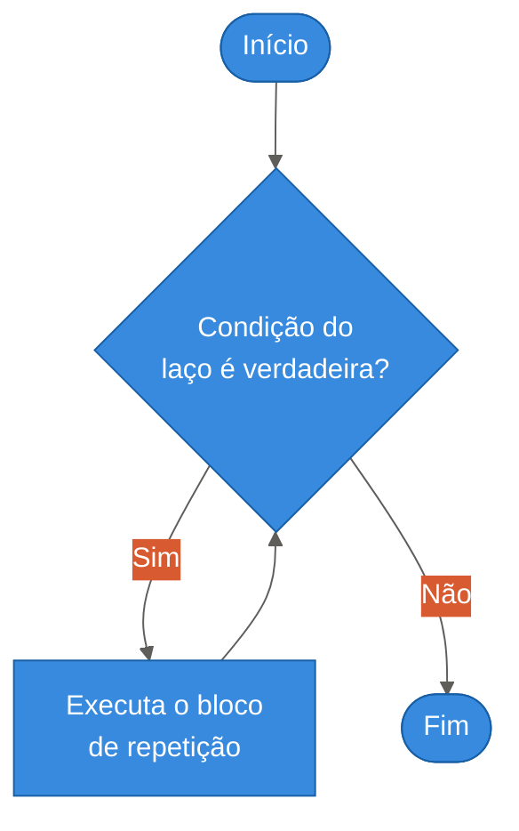
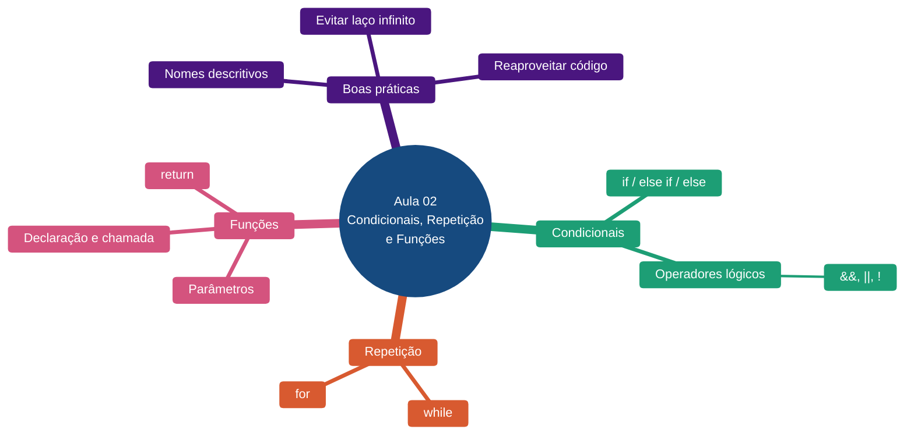

# Aula 02 — Lógica Computacional: Estruturas Condicionais, de Repetição e Funções

**Disciplina:** Desenvolvimento Web
**Duração:** 3h
**Etapa da trilha:** Etapa 1 — Fundamentos da Web (Lógica computacional + HTML)

**Objetivos de aprendizagem:**

- Usar estruturas condicionais (`if`/`else if`/`else`) para tomar decisões dentro de um programa.
- Usar estruturas de repetição (`for`, `while`) para repetir tarefas sem duplicar código.
- Criar e chamar funções básicas, com parâmetros e retorno, para organizar e reaproveitar lógica.

---

## 1. Contextualização

Na aula anterior, vimos como cliente e servidor se comunicam e demos os primeiros passos em JavaScript: variáveis, tipos de dados e operadores. Com isso já é possível guardar valores e calcular coisas novas a partir deles — mas todo programa até agora executa **sempre a mesma sequência de linhas, do início ao fim**, sem nunca decidir nada nem repetir nada.

Pense em um programa que precisa dizer se um aluno foi aprovado, ou que precisa exibir uma mensagem 20 vezes, ou validar um formulário de cadastro. Nenhuma dessas tarefas é possível sem duas capacidades novas: **tomar decisões** (executar um trecho de código só se uma condição for verdadeira) e **repetir tarefas** (executar o mesmo trecho várias vezes sem copiar e colar). Junto com isso, vamos aprender a empacotar lógica em **funções**, para não precisar reescrever o mesmo código toda vez que ele for necessário.

---

## 2. Conteúdo teórico incremental

### 2.1 Estruturas condicionais: `if`, `else if`, `else`

Uma estrutura condicional executa um bloco de código **somente se** uma condição for verdadeira:

```js
if (idade >= 18) {
  console.log("Maior de idade");
} else {
  console.log("Menor de idade");
}
```

Quando há mais de duas possibilidades, usa-se `else if` para encadear novas condições:

```js
if (nota >= 7) {
  console.log("Aprovado");
} else if (nota >= 5) {
  console.log("Recuperação");
} else {
  console.log("Reprovado");
}
```

As condições são sempre expressões que resultam em `true` ou `false` — exatamente como os operadores de comparação (`>=`, `==`, `<`...) vistos na aula passada.

> [!IMPORTANT]
> Só o primeiro bloco cuja condição for verdadeira é executado. Depois disso, o JavaScript ignora todo o resto da cadeia `if`/`else if`/`else`, mesmo que outra condição também fosse verdadeira.

### 2.2 Operadores lógicos

Operadores lógicos combinam duas ou mais condições em uma única expressão:

- **`&&` (E)** — verdadeiro somente se **todas** as condições forem verdadeiras.
- **`||` (OU)** — verdadeiro se **pelo menos uma** condição for verdadeira.
- **`!` (negação)** — inverte o valor de uma condição (`true` vira `false` e vice-versa).

```js
let idade = 20;
let temCarteira = true;

if (idade >= 18 && temCarteira) {
  console.log("Pode dirigir");
}
```

> [!TIP]
> Leia `&&` como "e" e `||` como "ou" em português — isso ajuda a montar a condição do jeito que você pensaria a regra em voz alta.

### 2.3 Estruturas de repetição: `for` e `while`

Um laço de repetição (*loop*) executa um bloco de código várias vezes, evitando duplicar a mesma linha.

**`for`** é usado quando já sabemos **quantas vezes** queremos repetir:

```js
for (let i = 1; i <= 3; i++) {
  console.log(i);
}
```

O `for` tem três partes, separadas por `;`: a inicialização (`let i = 1`), a condição que mantém o laço rodando (`i <= 3`) e o incremento, executado a cada volta (`i++`).

**`while`** é usado quando a repetição depende de uma condição que só pode ser avaliada durante a execução, sem um número fixo de voltas definido de antemão:

```js
let senha = "";
while (senha !== "1234") {
  senha = "1234"; // em um programa real, viria de uma entrada do usuário
}
console.log("Senha correta!");
```

> [!WARNING]
> Todo laço precisa, em algum momento, tornar sua condição falsa. Se isso nunca acontecer, o laço roda para sempre (*loop infinito*) e trava o programa — sempre confira se a variável usada na condição está mudando dentro do bloco.

### 2.4 Funções básicas

Uma função empacota um trecho de código para ser reutilizado sempre que necessário, sem reescrevê-lo:

```js
function dobro(numero) {
  return numero * 2;
}

console.log(dobro(5)); // 10
console.log(dobro(10)); // 20
```

- `function dobro(numero)` **declara** a função: `dobro` é o nome, `numero` é o **parâmetro** (um valor que a função recebe).
- `return` devolve um valor para quem chamou a função e encerra a execução dela.
- `dobro(5)` é a **chamada** da função, passando `5` como **argumento** — o valor real usado naquela chamada.

> [!NOTE]
> Sem `return`, uma função executa normalmente, mas devolve `undefined` para quem a chamou.

---

## 3. Diagramas

### 3.1 Fluxo de uma estrutura condicional

```mermaid
%%{init: {'theme':'base', 'themeVariables': {
  'primaryColor': '#378ADD',
  'primaryTextColor': '#FFFFFF',
  'primaryBorderColor': '#185FA5',
  'secondaryColor': '#D85A30',
  'secondaryTextColor': '#FFFFFF',
  'tertiaryTextColor': '#2C2C2A',
  'lineColor': '#5F5E5A',
  'textColor': '#2C2C2A',
  'noteBkgColor': '#FFF6DA',
  'noteTextColor': '#2C2C2A',
  'noteBorderColor': '#D9B84A'
}}}%%
flowchart TD
    A([Início]) --> B{Condição é<br/>verdadeira?}
    B -- Sim --> C[Executa o bloco do "if"]
    B -- Não --> D[Executa o bloco do "else"]
    C --> E([Fim])
    D --> E([Fim])
```

### 3.2 Fluxo de uma estrutura de repetição



---

## 4. Exemplo de código

### Antes de rodar

Leia o código abaixo com atenção e responda: **o que você acha que vai aparecer no console, linha por linha?**

```js
// Etapa 1: declarar uma função que verifica se um número é par
function ehPar(numero) {
  return numero % 2 === 0;
}

// Etapa 2: repetir a verificação para vários números
for (let i = 1; i <= 5; i++) {
  // Etapa 3: usar a função dentro de uma decisão
  if (ehPar(i)) {
    console.log(i + " é par");
  } else {
    console.log(i + " é ímpar");
  }
}
```

### Execute e confira

Execute o código no console do navegador (ou em um arquivo `.js` com Node). O resultado esperado é:

```
1 é ímpar
2 é par
3 é ímpar
4 é par
5 é ímpar
```

### Entendendo o código linha a linha

- **Etapa 1 — declarar uma função que verifica se um número é par**
  - `numero % 2` usa o operador de resto da divisão (`%`), que devolve o que sobra ao dividir `numero` por `2`.
  - `numero % 2 === 0` compara esse resto com `0`: se não sobra resto, o número é par.
  - `return` devolve o resultado dessa comparação (`true` ou `false`) para quem chamar `ehPar(...)`.
- **Etapa 2 — repetir a verificação para vários números**
  - `for (let i = 1; i <= 5; i++)` cria a variável `i` começando em `1`, repete enquanto `i <= 5`, e soma `1` a `i` a cada volta.
  - O bloco entre `{ }` roda uma vez para cada valor de `i`: `1`, `2`, `3`, `4` e `5`.
- **Etapa 3 — usar a função dentro de uma decisão**
  - `ehPar(i)` chama a função criada na Etapa 1, passando o valor atual de `i`.
  - Como `ehPar` devolve `true` ou `false`, o resultado pode ser usado diretamente como condição do `if`.

### Agora modifique

Altere o código para:

1. Trocar o laço para verificar números de `1` até `10`, em vez de até `5`.
2. Rodar novamente e conferir se todos os pares e ímpares entre 1 e 10 aparecem corretamente, sem precisar mudar nenhuma outra linha do código.

### Desafio

Agora é sua vez: crie uma função `classificaTemperatura(temperatura)` que devolva `"frio"` se a temperatura for menor que `15`, `"ameno"` se estiver entre `15` e `25`, e `"quente"` se for maior que `25`. Depois, use um laço `for` para testar essa função com pelo menos cinco temperaturas diferentes, exibindo o resultado de cada uma no console.

---

## 5. Infográfico-resumo



---

## 6. Exercícios

### 6.1 Questão para discussão em sala

**Pergunta:** Qual das alternativas descreve corretamente quando usar um laço `for` e quando usar um laço `while`?

- **A.** `for` deve ser usado apenas com textos; `while` só funciona com números.
- **B.** `for` é ideal quando já sabemos, de antemão, quantas vezes queremos repetir; `while` é ideal quando a repetição depende de uma condição que só pode ser avaliada durante a execução.
- **C.** Não há diferença prática entre `for` e `while`; a escolha é apenas estética.
- **D.** `while` sempre executa pelo menos uma vez, enquanto `for` pode nunca executar.

<details>
<summary>Gabarito</summary>

Alternativa **B**. Use `for` quando o número de repetições é conhecido antes do laço começar (ex.: "repita 10 vezes"). Use `while` quando a repetição depende de uma condição que só se resolve durante a execução do programa (ex.: "repita até o usuário digitar a senha certa").

</details>

---

### 6.2 Exercícios

**1.** As linhas abaixo estão embaralhadas. Reordene-as para formar um programa que exiba `"Contando: 1"`, `"Contando: 2"` e `"Contando: 3"` no console, um por linha.

```js
}
console.log("Contando: " + i);
for (let i = 1; i <= 3; i++) {
```

<details>
<summary>Dica</summary>

A linha do `for` sempre abre o bloco (termina em `{`) e deve vir primeiro, pois é ela quem cria e controla a variável `i`. O `console.log` fica dentro do bloco, por isso é a linha do meio. A chave de fechamento `}` sempre vem por último, encerrando o bloco de repetição.

</details>

**2.** Qual será o valor exibido no console pelo código abaixo?

```js
let temperatura = 0;

if (temperatura > 0) {
  console.log("Positiva");
} else if (temperatura < 0) {
  console.log("Negativa");
} else {
  console.log("Zero");
}
```

<details>
<summary>Dica</summary>

Nenhuma das duas primeiras condições (`> 0` e `< 0`) é verdadeira quando `temperatura` vale `0` — por isso a execução cai no bloco `else`, que não depende de nenhuma condição.

</details>

**3.** O trecho abaixo repete a mesma linha três vezes. Reescreva-o usando um laço `for`, sem alterar a mensagem exibida.

```js
console.log("Aula 02");
console.log("Aula 02");
console.log("Aula 02");
```

<details>
<summary>Dica</summary>

Como a mensagem não muda a cada repetição, você só precisa controlar quantas vezes o laço roda: `for (let i = 0; i < 3; i++) { console.log("Aula 02"); }`.

</details>

**4.** Escreva um laço `while` que exiba no console os números de `5` até `1`, em ordem decrescente.

<details>
<summary>Dica</summary>

Comece uma variável em `5` e, dentro do laço, exiba o valor e depois subtraia `1` dela (`contador--`), repetindo enquanto o valor for maior que `0`.

</details>

**5.** Crie uma função `dobro(numero)` que devolva o dobro do número recebido, e teste-a chamando-a com três valores diferentes, exibindo cada resultado com `console.log`.

<details>
<summary>Dica</summary>

Dentro da função, use `return numero * 2;` para devolver o resultado calculado. Cada chamada, como `dobro(7)`, pode ser colocada diretamente dentro de um `console.log(...)`.

</details>

**6.** Crie uma função `classificaIdade(idade)` que devolva `"criança"` para idades menores que `12`, `"adolescente"` para idades entre `12` e `17`, e `"adulto"` para idades de `18` ou mais. Teste a função chamando-a com pelo menos três idades diferentes.

<details>
<summary>Dica</summary>

Use uma cadeia `if`/`else if`/`else`, testando primeiro a condição de idade menor, depois a condição intermediária, e deixando o `else` cobrir o restante dos casos (idade adulta).

</details>

**7.** Escreva um programa que use um laço `for` de `1` até `20` junto com uma função `ehMultiploDeTres(numero)`, exibindo no console apenas os números que são múltiplos de `3` dentro desse intervalo.

<details>
<summary>Dica</summary>

Um número é múltiplo de `3` quando o resto da divisão por `3` é igual a `0` (`numero % 3 === 0`). Essa comparação pode ser o próprio `return` da função `ehMultiploDeTres`; dentro do laço, use um `if` para só chamar `console.log` quando a função devolver `true`.

</details>

---

## 7. Referências

**Básica**

- MDN Web Docs. *Estruturas de controle e loops em JavaScript*. Disponível em: https://developer.mozilla.org/pt-BR/docs/Learn/JavaScript/Building_blocks/Looping_code
- MDN Web Docs. *Funções — blocos de código reutilizáveis*. Disponível em: https://developer.mozilla.org/pt-BR/docs/Learn/JavaScript/Building_blocks/Functions

**Complementar**

- MDN Web Docs. *Estruturas condicionais em JavaScript*. Disponível em: https://developer.mozilla.org/pt-BR/docs/Learn/JavaScript/Building_blocks/conditionals
- W3Schools. *JavaScript Functions*. Disponível em: https://www.w3schools.com/js/js_functions.asp

---

## 8. Ponte para a próxima aula

Agora que já sabemos tomar decisões, repetir tarefas e organizar lógica em funções, a próxima aula deixa por um momento a lógica pura e volta para a estrutura da página em si: vamos ver como montar o documento HTML5 corretamente, usando tags semânticas (`header`, `main`, `section`, `footer`) e boas práticas de acessibilidade — a base sobre a qual toda a interatividade que já sabemos programar vai ser aplicada.
