# Aula 02 — Tomando Decisões e Repetindo Tarefas: Condicionais, Laços e Funções

[Desenvolvimento Web](../README.md) > Aula 02

**Disciplina:** Desenvolvimento Web
**Duração:** 3h
**Etapa da trilha:** Etapa 1 — Fundamentos da Web (Lógica computacional + HTML)

**Objetivos de aprendizagem:**

- Usar estruturas condicionais (`if`, `else if`, `else`) combinadas a operadores lógicos para que o código tome decisões.
- Usar estruturas de repetição (`for` e `while`) para repetir uma tarefa várias vezes sem duplicar código.
- Declarar e usar funções básicas para organizar e reaproveitar lógica.

---

## 1. Contextualização

Na aula passada, você declarou variáveis, guardou valores de tipos diferentes (`string`, `number`, `boolean`) e usou operadores para gerar novos valores e comparações — tudo isso testado no console do navegador.

Só que, até agora, todo código que escrevemos executa **sempre, do início ao fim, sem desviar de caminho**. Na prática, quase nenhum programa é assim: um sistema de matrícula precisa decidir se um aluno pode ou não se inscrever numa disciplina; uma loja online precisa repetir o cálculo do frete para cada item do carrinho; um formulário precisa validar o mesmo campo toda vez que o usuário digita algo.

Hoje você aprende as duas ferramentas que resolvem exatamente isso:

- **Estruturas condicionais** — fazem o código escolher um caminho diferente dependendo de uma condição.
- **Estruturas de repetição** — fazem o código repetir uma tarefa várias vezes, sem copiar e colar a mesma linha.

E para organizar tudo isso, vamos também dar os primeiros passos em **funções**: blocos de código com nome, que podem ser reaproveitados sempre que precisar daquela lógica de novo.

---

## 2. Estruturas condicionais e de repetição

### 2.1 Estruturas condicionais: `if`, `else if`, `else`

Uma estrutura condicional testa uma expressão que resulta em `true` ou `false` (lembra dos operadores de comparação da aula passada, como `>=`?) e executa um bloco de código diferente dependendo do resultado.

```js
if (condição) {
  // executa se a condição for true
} else {
  // executa se a condição for false
}
```

É possível encadear várias condições com `else if`, testadas em ordem, de cima para baixo, até uma delas ser verdadeira:

```js
if (condição1) {
  // executa se condição1 for true
} else if (condição2) {
  // executa se condição1 for false e condição2 for true
} else {
  // executa se nenhuma das anteriores for true
}
```

> [!IMPORTANT]
> Assim que uma condição é verdadeira, o JavaScript executa aquele bloco e **ignora todos os `else if`/`else` seguintes** — mesmo que outra condição mais abaixo também fosse verdadeira. A ordem das condições importa.

### 2.2 Operadores lógicos: combinando condições

Às vezes uma decisão depende de mais de uma condição ao mesmo tempo. Para isso existem os operadores lógicos:

| Operador | Nome | Resultado é `true` quando... |
|---|---|---|
| `&&` | E (AND) | **as duas** condições forem verdadeiras |
| `\|\|` | OU (OR) | **pelo menos uma** das condições for verdadeira |
| `!` | Negação (NOT) | inverte o valor: `!true` vira `false` |

```js
let idade = 20;
let temCarteira = true;

console.log(idade >= 18 && temCarteira); // true — as duas condições são verdadeiras
console.log(idade >= 18 || temCarteira); // true — basta uma ser verdadeira
console.log(!temCarteira);               // false — inverte o valor de temCarteira
```

> [!CAUTION]
> É comum, no início, confundir `&&` com `||`. Uma forma de não errar: leia `&&` como "e, **obrigatoriamente as duas**" e `||` como "ou, **basta uma**". Errar essa troca algumas vezes faz parte de aprender a lógica — o importante é conferir sempre testando valores diferentes no console.

### 2.3 Estrutura de repetição: `for`

O `for` repete um bloco de código um número de vezes controlado por um contador. Ele tem três partes, sempre nesta ordem:

```js
for (inicialização; condição; incremento) {
  // repete enquanto a condição for true
}
```

- **Inicialização** — roda uma única vez, antes do laço começar (geralmente cria um contador, ex.: `let i = 0`).
- **Condição** — testada antes de cada repetição; enquanto for `true`, o laço continua.
- **Incremento** — roda ao final de cada repetição (geralmente aumenta o contador, ex.: `i++`).

```js
for (let i = 1; i <= 3; i++) {
  console.log("Repetição número " + i);
}
```

Use `for` sempre que você já souber, de antemão, **quantas vezes** algo deve se repetir.

### 2.4 Estrutura de repetição: `while`

O `while` também repete um bloco de código, mas sem contador embutido — ele repete **enquanto uma condição for `true`**, e nada mais:

```js
let repetir = true;

while (repetir) {
  // roda enquanto "repetir" for true
  // em algum momento do bloco, algo precisa tornar "repetir" false
}
```

Use `while` quando você **não sabe de antemão** quantas repetições vão acontecer — por exemplo, repetir até o usuário digitar a senha correta.

> [!WARNING]
> Se nada dentro do `while` alterar a condição para `false` em algum momento, o laço nunca para — isso se chama **loop infinito** e trava a página. Sempre confira se existe um caminho para a condição se tornar falsa.

### 2.5 Funções básicas

Uma função é um bloco de código com nome, que pode receber valores de entrada (**parâmetros**) e devolver um resultado (**retorno**) com `return`.

```js
function nomeDaFuncao(parametro1, parametro2) {
  // lógica da função
  return resultado;
}
```

Depois de declarada, a função pode ser chamada quantas vezes for necessário, passando valores diferentes:

```js
function somar(a, b) {
  return a + b;
}

console.log(somar(2, 3)); // 5
console.log(somar(10, 20)); // 30
```

> [!TIP]
> Sem `return`, a função executa normalmente, mas o resultado dela é `undefined`. Use `return` sempre que a função precisar devolver um valor para ser usado depois (guardado em uma variável, exibido no console, etc.).

---

## 3. Diagramas

### 3.1 Fluxo de uma decisão com `if`/`else if`/`else`

O diagrama abaixo mostra como o JavaScript decide qual bloco executar ao avaliar a nota de um aluno com duas condições encadeadas.



*Código-fonte do diagrama: [`diagramas/01-fluxo-condicional.mmd`](diagramas/01-fluxo-condicional.mmd)*

### 3.2 Fluxo de execução de um laço de repetição

O diagrama abaixo mostra o ciclo de um laço `for`: a condição é testada antes de cada repetição, e o laço só termina quando ela se torna falsa.



*Código-fonte do diagrama: [`diagramas/02-fluxo-repeticao.mmd`](diagramas/02-fluxo-repeticao.mmd)*

---

## 4. Exemplo de código

### Antes de rodar

Leia o código abaixo com atenção. Ele junta os três assuntos da aula: uma função com `if`/`else if`/`else`, chamada repetidas vezes dentro de um `for`.

**O que você acha que vai aparecer no console, linha por linha, para os alunos 1 a 5?**

```js
// Etapa 1: função que decide a situação do aluno a partir da nota
function verificarSituacao(nota) {
  if (nota >= 7) {
    return "Aprovado";
  } else if (nota >= 5) {
    return "Exame final";
  } else {
    return "Reprovado";
  }
}

// Etapa 2: repetir a verificação para os 5 alunos da turma
for (let aluno = 1; aluno <= 5; aluno++) {
  let nota = 10 - aluno; // cada aluno tem uma nota diferente, só para o exemplo
  let situacao = verificarSituacao(nota);
  console.log("Aluno " + aluno + " (nota " + nota + "): " + situacao);
}
```

### Execute e confira

O resultado esperado é:

```
Aluno 1 (nota 9): Aprovado
Aluno 2 (nota 8): Aprovado
Aluno 3 (nota 7): Aprovado
Aluno 4 (nota 6): Exame final
Aluno 5 (nota 5): Exame final
```

### Entendendo o código linha a linha

- **Etapa 1 — função que decide a situação do aluno**
  - `function verificarSituacao(nota) { ... }` declara uma função que recebe um parâmetro (`nota`).
  - Dentro dela, três caminhos são testados em ordem: `nota >= 7`, depois `nota >= 5`, e por fim o `else` cobre qualquer outro caso.
  - Cada caminho termina em um `return`, que interrompe a função e devolve o texto correspondente.
- **Etapa 2 — repetir a verificação para os 5 alunos**
  - O `for` roda com `aluno` começando em `1`, repetindo enquanto `aluno <= 5`, incrementando `aluno` a cada volta.
  - Em cada repetição, `nota` é recalculada, a função `verificarSituacao` é chamada de novo com um valor diferente, e o resultado é exibido com `console.log`.
  - Perceba que a mesma função é reaproveitada 5 vezes — sem copiar e colar o `if`/`else if`/`else` cinco vezes.

### Agora modifique

Reescreva o `for` da Etapa 2 usando um `while` no lugar, mantendo exatamente o mesmo resultado. Dica: você vai precisar declarar `let aluno = 1;` antes do laço e incrementar `aluno` manualmente dentro do bloco, já que o `while` não tem essas partes embutidas como o `for`.

### Desafio

Crie uma função chamada `verificarPar` que recebe um número e retorna o texto `"par"` ou `"ímpar"` (dica: um número é par quando o resto da divisão por 2 é igual a zero — em JavaScript, o operador de resto é `%`). Depois, use um `for` para chamar essa função para os números de 1 a 10, exibindo o resultado de cada um no console.

---

## 5. Resumo



*Código-fonte do diagrama: [`diagramas/03-resumo-aula-02.mmd`](diagramas/03-resumo-aula-02.mmd)*

- `if`/`else if`/`else` escolhem um caminho de execução com base em uma condição.
- `&&`, `||` e `!` combinam ou invertem condições.
- `for` repete um número conhecido de vezes; `while` repete enquanto uma condição for verdadeira.
- Funções organizam lógica em blocos com nome, reaproveitáveis, que podem receber parâmetros e devolver um valor com `return`.

---

## 6. Exercícios

Pratique os conceitos desta aula na lista de exercícios dedicada, com questão de discussão em sala, exercícios de fixação e desafios de criação:

**[`exercicios/exercicios-02.md`](exercicios/exercicios-02.md)**

---

## 7. Referências

**Básica**

- MDN Web Docs. *if...else*. Disponível em: https://developer.mozilla.org/pt-BR/docs/Web/JavaScript/Reference/Statements/if...else
- MDN Web Docs. *for*. Disponível em: https://developer.mozilla.org/pt-BR/docs/Web/JavaScript/Reference/Statements/for

**Complementar**

- MDN Web Docs. *Estruturas de controle e loops em JavaScript*. Disponível em: https://developer.mozilla.org/pt-BR/docs/Learn/JavaScript/Building_blocks/Looping_code
- MDN Web Docs. *Functions — reusable blocks of code*. Disponível em: https://developer.mozilla.org/en-US/docs/Learn/JavaScript/Building_blocks/Functions

---

## 8. Próxima aula

Com decisões, repetições e funções básicas no repertório, a próxima aula sai da lógica pura e entra na estrutura das páginas: documento HTML5, tags semânticas (`header`, `main`, `section`, `footer`) e acessibilidade — a base sobre a qual, mais adiante, vamos aplicar tudo o que já aprendemos em JavaScript.
