# Aula 03 — Estrutura de uma Página Web: HTML5 Semântico e Acessibilidade

[Desenvolvimento Web](../README.md) > Aula 03

**Disciplina:** Desenvolvimento Web
**Duração:** 3h
**Etapa da trilha:** Etapa 1 — Fundamentos da Web (Lógica computacional + HTML)

**Objetivos de aprendizagem:**

- Explicar por que tags semânticas são preferíveis a `<div>` genéricas, tanto para acessibilidade quanto para manutenção do código.
- Estruturar o esqueleto de um documento HTML5 usando tags semânticas (`header`, `nav`, `main`, `section`, `article`, `aside`, `footer`).
- Aplicar boas práticas básicas de acessibilidade (`alt`, `lang`, hierarquia de headings) na montagem de uma página institucional.

---

## 1. Contextualização

Nas duas últimas aulas, você testou lógica JavaScript inteira dentro do console do navegador — variáveis, condicionais, laços e funções — sem nenhuma página "de verdade" ao redor desse código. Hoje isso muda: começamos a construir o documento que, mais adiante no curso, vai hospedar essa lógica.

Essa página não é só um exercício isolado: ela é o ponto de partida da **1ª entrega do projeto profissional** desta etapa, onde você vai estruturar o HTML da sua própria aplicação.

Um erro comum de quem está começando é estruturar tudo com `<div>`: funciona visualmente, mas não comunica nada sobre o *papel* de cada bloco — nem para quem lê o código depois, nem para tecnologias assistivas como leitores de tela, nem para buscadores. O HTML5 resolve isso com um conjunto de tags que descrevem a função de cada região da página, não só sua aparência.

---

## 2. Conteúdo teórico incremental

### 2.1 O problema da "div soup"

Imagine este trecho:

```html
<div class="topo">...</div>
<div class="menu">...</div>
<div class="conteudo">...</div>
<div class="rodape">...</div>
```

Visualmente, isso pode ficar idêntico à versão semântica que veremos a seguir. Mas um leitor de tela, um buscador ou outro desenvolvedor olhando esse código não têm como saber, só pelo nome da classe, que `.topo` é o cabeçalho da página ou que `.menu` é a navegação principal — `class` é só um gancho para CSS, sem significado estrutural nenhum para o navegador.

> [!NOTE]
> Esse padrão de encher a página inteira de `<div>` sem estrutura é apelidado, na comunidade, de **"div soup"** — sopa de divs.

### 2.2 Esqueleto de um documento HTML5

Todo documento HTML5 começa com a mesma base:

```html
<!DOCTYPE html>
<html lang="pt-BR">
<head>
  <meta charset="UTF-8">
  <meta name="viewport" content="width=device-width, initial-scale=1.0">
  <title>Título da página</title>
</head>
<body>
  <!-- conteúdo visível da página -->
</body>
</html>
```

- `<!DOCTYPE html>` avisa o navegador para renderizar seguindo o padrão HTML5.
- `<html lang="pt-BR">` declara o idioma do conteúdo — leitores de tela usam isso para escolher a pronúncia correta.
- `<meta charset="UTF-8">` garante que acentos e caracteres especiais apareçam corretamente.
- `<meta name="viewport" ...>` adapta a página para telas de celular.
- `<title>` é o texto exibido na aba do navegador e nos resultados de busca.

> [!IMPORTANT]
> `lang` e `charset` parecem detalhes pequenos, mas sem eles um leitor de tela pode pronunciar o texto no idioma errado, e caracteres acentuados podem aparecer corrompidos (`�` no lugar de `ã`, por exemplo).

### 2.3 Tags semânticas de estrutura

Dentro do `<body>`, use tags que descrevem o papel de cada região:

| Tag | Papel |
|---|---|
| `header` | Cabeçalho da página ou de uma seção — geralmente logo, título, navegação |
| `nav` | Bloco de links de navegação principal |
| `main` | Conteúdo principal e único da página (só um por página) |
| `section` | Agrupamento temático de conteúdo, geralmente com um heading |
| `article` | Conteúdo que faz sentido sozinho, mesmo fora da página (post, notícia, produto) |
| `aside` | Conteúdo relacionado, mas não essencial (barra lateral, dica relacionada) |
| `footer` | Rodapé da página ou de uma seção — contato, direitos autorais |

> [!TIP]
> Uma dúvida comum é a diferença entre `section` e `article`. Pergunte: "esse bloco faz sentido se eu tirá-lo da página e colocar em outro lugar, sozinho?" Se sim, é `article`. Se ele só faz sentido dentro do contexto da página atual, é `section`.

### 2.4 Hierarquia de headings

`<h1>` a `<h6>` não são só "texto grande, texto pequeno" — eles formam um índice hierárquico da página, usado inclusive por leitores de tela para navegação rápida entre seções.

- Use **um único `<h1>`** por página, representando o assunto principal.
- Não pule níveis por causa do tamanho visual (ex.: usar `<h4>` só porque o `<h3>` "está grande demais"). Se o tamanho não agrada, isso se ajusta com CSS, não trocando a tag.

### 2.5 Boas práticas de acessibilidade

- Toda `` relevante precisa de um atributo `alt` descrevendo a imagem — quem usa leitor de tela depende disso para saber o que está ali.
- `header` e `footer` que ficam diretamente dentro do `<body>` (não dentro de um `article` ou `section`) são automaticamente reconhecidos por leitores de tela como as regiões (**landmarks**) `banner` e `contentinfo`, permitindo pular direto para elas.

> [!CAUTION]
> `alt=""` (vazio) é diferente de não colocar `alt` nenhum. Use `alt=""` só quando a imagem é puramente decorativa e não deve ser anunciada. Se a imagem carrega informação, o `alt` precisa descrevê-la — nunca deixe em branco por preguiça de escrever a descrição.

---

## 3. Diagramas

### 3.1 Hierarquia das tags semânticas

O diagrama abaixo mostra como as tags de estrutura se aninham dentro de um documento HTML5 típico.



*Código-fonte do diagrama: [`diagramas/01-hierarquia-tags-semanticas.mmd`](diagramas/01-hierarquia-tags-semanticas.mmd)*

### 3.2 Qual tag semântica usar

Este fluxo ajuda a decidir qual tag encaixa em cada bloco de conteúdo, seguindo as perguntas da seção 2.3.



*Código-fonte do diagrama: [`diagramas/02-fluxo-escolha-tag-semantica.mmd`](diagramas/02-fluxo-escolha-tag-semantica.mmd)*

---

## 4. Exemplo de código

Vamos montar a estrutura de uma página institucional simples: a página de uma padaria fictícia.

### Antes de rodar

Leia o HTML abaixo com atenção e responda: **quantas regiões (landmarks) você acha que um leitor de tela vai identificar nesta página, e quais nomes ele daria a cada uma?**

```html
<!DOCTYPE html>
<html lang="pt-BR">
<head>
  <!-- Etapa 1: metadados do documento -->
  <meta charset="UTF-8">
  <meta name="viewport" content="width=device-width, initial-scale=1.0">
  <title>Padaria Pão Nosso</title>
</head>
<body>
  <!-- Etapa 2: cabeçalho e navegação -->
  <header>
    <h1>Padaria Pão Nosso</h1>
    <nav>
      <a href="#sobre">Sobre</a>
      <a href="#produtos">Produtos</a>
    </nav>
  </header>

  <!-- Etapa 3: conteúdo principal, dividido em seções temáticas -->
  <main>
    <section id="sobre">
      <h2>Sobre a padaria</h2>
      <p>Pães artesanais feitos todos os dias, desde 1998.</p>
    </section>

    <section id="produtos">
      <h2>Produtos</h2>
      
    </section>
  </main>

  <!-- Etapa 4: rodapé -->
  <footer>
    <p>Contato: (42) 99999-0000</p>
  </footer>
</body>
</html>
```

### Execute e confira

Renderizando essa página e navegando pelas landmarks (no Chrome, pela aba **Accessibility** do DevTools; em um leitor de tela, pelo atalho de navegação entre regiões), o resultado esperado é:

```
Landmarks identificadas:
- banner       (header, direto dentro do body)
- navigation   (nav)
- main         (main)
- contentinfo  (footer, direto dentro do body)
```

Repare que `section` **não aparece sozinha** nessa lista — ela só vira uma landmark `region` quando tem um nome acessível associado (ex.: `aria-label`), o que está fora do escopo de hoje.

### Entendendo o código linha a linha

- **Etapa 1 — metadados do documento**
  - `charset="UTF-8"` e o `<title>` já foram vistos na aula 01; aqui eles voltam porque toda página precisa desse cabeçalho técnico antes de qualquer conteúdo visível.
- **Etapa 2 — cabeçalho e navegação**
  - `<header>` concentra identidade da página (`<h1>`) e navegação (`<nav>`), e vira a landmark `banner` por estar direto dentro do `<body>`.
  - Os links dentro do `<nav>` apontam para os `id`s das seções logo abaixo (`#sobre`, `#produtos`) — navegação interna na própria página.
- **Etapa 3 — conteúdo principal**
  - `<main>` marca o conteúdo único da página; só pode haver um por documento.
  - Cada `<section>` agrupa um bloco temático, sempre com seu próprio heading (`<h2>`) — nunca uma `section` sem heading algum.
  - A `` tem um `alt` descritivo, não decorativo, porque carrega informação real (o produto sendo mostrado).
- **Etapa 4 — rodapé**
  - `<footer>` direto no `<body>` vira a landmark `contentinfo`, reconhecida por leitores de tela como "informações sobre o site" (contato, direitos autorais etc.).

### Agora modifique

Adicione uma terceira seção `<section id="contato">` dentro do `<main>`, com um `<h2>Contato</h2>` e um parágrafo com o endereço da padaria. Depois, adicione um link `<a href="#contato">Contato</a>` dentro do `<nav>`, apontando para essa nova seção.

### Desafio

Monte do zero o esqueleto semântico de uma página institucional para um negócio de sua escolha (academia, pet shop, estúdio de tatuagem etc.), com `header` + `nav`, `main` com pelo menos duas `section`, e `footer`. Garanta que toda `` tenha um `alt` descritivo e que exista um único `<h1>` na página.

---

## 5. Resumo



*Código-fonte do diagrama: [`diagramas/03-resumo-aula-03.mmd`](diagramas/03-resumo-aula-03.mmd)*

- Tags semânticas (`header`, `nav`, `main`, `section`, `article`, `aside`, `footer`) descrevem o papel de cada região, ao contrário de `<div>`.
- `main` é único por página; `section` agrupa temas; `article` faz sentido sozinho; `aside` é complementar.
- Headings formam uma hierarquia (`h1` único, sem pular níveis), usada como índice por leitores de tela.
- `alt` em imagens e `lang` no `html` não são opcionais — são a base da acessibilidade de uma página.

---

## 6. Exercícios

Pratique os conceitos desta aula na lista de exercícios dedicada, com questão de discussão em sala, exercícios de fixação e desafios de criação:

**[`exercicios/exercicios-03.md`](exercicios/exercicios-03.md)**

---

## 7. Referências

**Básica**

- MDN Web Docs. *HTML semântico*. Disponível em: https://developer.mozilla.org/pt-BR/docs/Glossary/Semantics

**Complementar**

- MDN Web Docs. *Estruturação básica de uma página web*. Disponível em: https://developer.mozilla.org/en-US/docs/Learn_web_development/Core/Structuring_content/Webpage_structuring
- WebAIM. *Semantic Structure*. Disponível em: https://webaim.org/techniques/semanticstructure/

---

## 8. Próxima aula

Com a estrutura semântica da página no lugar, a próxima aula preenche essa estrutura com os elementos que capturam informação do usuário: formulários, `input`s, tabelas, mídia (`img`, `audio`, `video`) e validação nativa do HTML5.
