# Aula 04 — Formulários, Tabelas e Mídia em HTML5

[Desenvolvimento Web](../README.md) > Aula 04

**Disciplina:** Desenvolvimento Web
**Duração:** 3h
**Etapa da trilha:** Etapa 1 — Fundamentos da Web (Lógica computacional + HTML)

**Objetivos de aprendizagem:**

- Estruturar formulários HTML5 usando os elementos de entrada apropriados para cada tipo de dado coletado.
- Aplicar atributos de validação nativa (`required`, `pattern`, `minlength`, `min`/`max`) para impedir o envio de dados inválidos sem depender de JavaScript.
- Estruturar tabelas semânticas para exibir dados tabulares e inserir mídia (`img`, `audio`, `video`) de forma acessível.

---

## 1. Contextualização

Na aula passada, você aprendeu a estruturar o esqueleto semântico de uma página com `header`, `nav`, `main`, `section` e `footer` — o "corpo" da página estava pronto, mas ele só exibia conteúdo, nunca coletava nada do usuário.

Hoje isso muda: vamos preencher essa estrutura com os elementos que capturam informação — formulários, campos de entrada, tabelas de dados e mídia (imagem, áudio, vídeo). É com esses elementos que a sua página passa de "folheto digital" para algo que interage de verdade com quem a visita.

Um detalhe importante logo de início: o HTML5 já vem com validação de formulários embutida no navegador, sem precisar de nenhuma linha de JavaScript. Boa parte da aula de hoje é sobre usar bem esses atributos nativos antes de sequer pensar em validação via código.

---

## 2. Conteúdo teórico incremental

### 2.1 Estrutura básica de um formulário

Um formulário HTML começa com a tag `<form>`, que agrupa os campos de entrada e define para onde e como os dados serão enviados:

```html
<form action="/inscricao" method="post">
  <!-- campos do formulário -->
</form>
```

- `action` — URL para onde os dados são enviados quando o formulário é submetido.
- `method` — como os dados são enviados: `get` (anexa os dados na própria URL, visível e limitada em tamanho) ou `post` (envia os dados no corpo da requisição, sem aparecer na URL).

> [!CAUTION]
> `method="get"` nunca deve ser usado em formulários com dados sensíveis (senha, dados pessoais). Como os valores ficam expostos na URL, eles aparecem no histórico do navegador, em logs de servidor e podem ser compartilhados sem querer ao copiar o link da página.

Cada campo de entrada deve estar associado a um `<label>`, conectado pelo par `for`/`id`:

```html
<label for="nome">Nome completo</label>
<input type="text" id="nome" name="nome">
```

> [!IMPORTANT]
> Sem essa associação, um leitor de tela anuncia o campo sem dizer o que ele representa — o mesmo problema de acessibilidade que vimos com `alt` na aula 03, agora aplicado a formulários. Clicar no texto do `label` também passa a focar o campo automaticamente, o que ajuda qualquer usuário, não só quem usa tecnologia assistiva.

### 2.2 Tipos de input

O atributo `type` do `<input>` não é só cosmético — ele muda o teclado exibido em dispositivos móveis, o formato aceito e as regras de validação nativa aplicadas ao campo.

| `type` | Uso |
|---|---|
| `text` | Texto livre, sem formato específico |
| `email` | E-mail — o navegador exige o formato `algo@algo.algo` |
| `password` | Senha — o valor é mascarado na tela |
| `number` | Valor numérico, com `min`/`max`/`step` opcionais |
| `date` | Data, com seletor de calendário nativo |
| `tel` | Telefone — não valida formato sozinho, mas ativa teclado numérico no celular |
| `checkbox` | Uma ou mais opções independentes |
| `radio` | Uma única opção entre um grupo mutuamente exclusivo |

> [!CAUTION]
> `type="password"` só **mascara visualmente** o valor digitado — ele não criptografa nada. Sem `method="post"` e uma conexão HTTPS, a senha ainda trafega de forma pouco segura.

Além do `<input>`, dois outros elementos completam os formulários:

```html
<label for="comentario">Comentário</label>
<textarea id="comentario" name="comentario" rows="4"></textarea>

<label for="nivel">Nível de experiência</label>
<select id="nivel" name="nivel">
  <option value="iniciante">Iniciante</option>
  <option value="intermediario">Intermediário</option>
  <option value="avancado">Avançado</option>
</select>
```

- `<textarea>` — texto livre em várias linhas.
- `<select>` — lista suspensa de opções fixas, alternativa ao grupo de `radio` quando há muitas opções.

### 2.3 Validação nativa HTML5

O navegador consegue validar boa parte de um formulário sozinho, usando atributos no próprio `<input>`:

```html
<input type="email" name="email" required>
<input type="password" name="senha" minlength="8" required>
<input type="tel" name="telefone" pattern="\(\d{2}\) \d{5}-\d{4}">
```

- `required` — o campo não pode ficar vazio.
- `minlength` / `maxlength` — quantidade mínima/máxima de caracteres.
- `min` / `max` — valor mínimo/máximo (em campos `number` ou `date`).
- `pattern` — uma expressão regular que o valor precisa satisfazer.

Quando algum desses atributos falha, o navegador **bloqueia o envio automaticamente** e mostra uma mensagem de erro nativa, sem precisar de nenhum código adicional.

> [!NOTE]
> `pattern` usa a mesma sintaxe de expressões regulares (regex) que você talvez já tenha visto em outras linguagens. No exemplo acima, ele exige o formato brasileiro `(42) 99999-0000`.

> [!WARNING]
> Validação nativa protege a experiência do usuário no navegador, mas **nunca substitui validação no servidor**. Qualquer pessoa pode desativar o JavaScript ou enviar uma requisição diretamente para a `action` do formulário, ignorando completamente os atributos do HTML.

### 2.4 Tabelas

Tabelas exibem dados organizados em linhas e colunas — não devem ser usadas para layout de página, só para dados que realmente são tabulares (uma planilha de preços, por exemplo).

```html
<table>
  <caption>Turmas disponíveis</caption>
  <thead>
    <tr>
      <th>Turma</th>
      <th>Horário</th>
      <th>Vagas</th>
    </tr>
  </thead>
  <tbody>
    <tr>
      <td>Manhã</td>
      <td>08h–10h</td>
      <td>12</td>
    </tr>
    <tr>
      <td>Noite</td>
      <td>19h–21h</td>
      <td>5</td>
    </tr>
  </tbody>
</table>
```

- `<caption>` — título da tabela, lido por leitores de tela antes do conteúdo.
- `<thead>` / `<tbody>` — separam o cabeçalho do corpo da tabela.
- `<th>` — célula de cabeçalho (linha ou coluna); `<td>` — célula de dado comum.

> [!TIP]
> Usar `<th>` em vez de `<td>` para os cabeçalhos não é só uma questão de negrito automático: leitores de tela anunciam o cabeçalho correspondente ao navegar célula por célula, o que só funciona se a tag semântica estiver correta.

### 2.5 Mídia: imagem, áudio e vídeo

Você já viu `` na aula 03 — o mesmo cuidado com `alt` vale aqui. Para áudio e vídeo, o HTML5 oferece tags nativas, sem precisar de plugins externos:

```html
<audio controls>
  <source src="podcast-aula.mp3" type="audio/mpeg">
  Seu navegador não suporta áudio embutido.
</audio>

<video controls width="480">
  <source src="demo-formulario.mp4" type="video/mp4">
  Seu navegador não suporta vídeo embutido.
</video>
```

- `controls` — exibe os controles nativos do navegador (play, pausa, volume).
- `<source>` — permite oferecer mais de um formato do mesmo arquivo; o navegador usa o primeiro que suportar.
- O texto dentro da tag (`Seu navegador não suporta...`) só aparece se nenhum `<source>` puder ser reproduzido — é o conteúdo alternativo.

> [!TIP]
> Assim como `alt` descreve uma imagem para quem não pode vê-la, vídeos importantes para o conteúdo do curso devem oferecer legendas (`<track kind="captions">`) sempre que possível — fora do escopo de hoje, mas vale manter em mente para acessibilidade.

---

## 3. Diagramas

### 3.1 Fluxo de validação nativa ao enviar um formulário

O diagrama abaixo mostra o que o navegador faz internamente entre o clique em "Enviar" e o formulário realmente ser enviado ao servidor.



*Código-fonte do diagrama: [`diagramas/01-fluxo-validacao-formulario.mmd`](diagramas/01-fluxo-validacao-formulario.mmd)*

### 3.2 Qual tipo de input usar

Este fluxo ajuda a decidir o `type` correto para um campo, seguindo as perguntas da seção 2.2.



*Código-fonte do diagrama: [`diagramas/02-fluxo-escolha-tipo-input.mmd`](diagramas/02-fluxo-escolha-tipo-input.mmd)*

---

## 4. Exemplo de código

Vamos montar um formulário de inscrição para um workshop de programação, aplicando validação nativa.

### Antes de rodar

Leia o HTML abaixo com atenção e responda: **o que acontece se você clicar em "Inscrever-se" deixando o campo de e-mail vazio? E se digitar uma senha com só 4 caracteres?**

```html
<!DOCTYPE html>
<html lang="pt-BR">
<head>
  <meta charset="UTF-8">
  <meta name="viewport" content="width=device-width, initial-scale=1.0">
  <title>Inscrição — Workshop de Programação</title>
</head>
<body>
  <main>
    <h1>Inscrição — Workshop de Programação</h1>

    <!-- Etapa 1: dados de identificação -->
    <form action="/inscricao" method="post">
      <label for="nome">Nome completo</label>
      <input type="text" id="nome" name="nome" required>

      <label for="email">E-mail</label>
      <input type="email" id="email" name="email" required>

      <label for="senha">Senha (mín. 8 caracteres)</label>
      <input type="password" id="senha" name="senha" minlength="8" required>

      <!-- Etapa 2: preferência de participação -->
      <fieldset>
        <legend>Como você vai participar?</legend>

        <input type="radio" id="presencial" name="participacao" value="presencial" checked>
        <label for="presencial">Presencial</label>

        <input type="radio" id="online" name="participacao" value="online">
        <label for="online">Online</label>
      </fieldset>

      <!-- Etapa 3: envio -->
      <button type="submit">Inscrever-se</button>
    </form>
  </main>
</body>
</html>
```

### Execute e confira

Testando esse formulário no navegador:

```
Campo de e-mail vazio ao clicar em "Inscrever-se":
→ Navegador bloqueia o envio e mostra "Preencha este campo."
  com o foco automaticamente no campo de e-mail.

Senha com 4 caracteres:
→ Navegador bloqueia o envio e mostra
  "Use pelo menos 8 caracteres." abaixo do campo de senha.
```

Repare que nenhuma dessas mensagens veio de código escrito por você — elas são geradas automaticamente pelo navegador a partir dos atributos `required` e `minlength`.

### Entendendo o código linha a linha

- **Etapa 1 — dados de identificação**
  - `type="email"` já valida o formato `algo@algo.algo` sozinho, sem `pattern` adicional.
  - `minlength="8"` no campo de senha define o tamanho mínimo aceito antes do envio ser permitido.
  - Todo campo tem `required`, então nenhum dos três pode ficar vazio.
- **`<fieldset>` e `<legend>`**
  - `<fieldset>` agrupa visualmente e semanticamente um conjunto de campos relacionados — aqui, o grupo de `radio` de participação.
  - `<legend>` é o "título" desse grupo, equivalente a um `<label>` para o `fieldset` inteiro.
  - `checked` no primeiro `radio` define "Presencial" como opção pré-selecionada.
- **Etapa 3 — envio**
  - `<button type="submit">` dispara a validação nativa de todos os campos do formulário antes de enviar os dados para a `action` definida.

### Agora modifique

Adicione um campo `<input type="checkbox" id="termos" name="termos" required>` com o `label` "Li e aceito os termos de participação", antes do botão de envio. Teste: o formulário deve continuar bloqueado até essa caixa ser marcada.

### Desafio

Adicione ao formulário um campo `<select>` chamado "Camiseta" com pelo menos três tamanhos (P, M, G), e um campo `type="tel"` para telefone de contato, usando `pattern` para exigir o formato `(99) 99999-9999`. Escolha livremente se esses dois campos são obrigatórios ou não.

---

## 5. Resumo



*Código-fonte do diagrama: [`diagramas/03-resumo-aula-04.mmd`](diagramas/03-resumo-aula-04.mmd)*

- `<form>` define `action` (para onde enviar) e `method` (`get` ou `post`, nunca `get` para dados sensíveis).
- O `type` do `<input>` muda o teclado, o formato aceito e a validação nativa aplicada — escolha sempre o mais específico para o dado.
- `required`, `pattern`, `minlength`/`maxlength` e `min`/`max` bloqueiam o envio de dados inválidos direto no navegador, mas nunca substituem validação no servidor.
- Tabelas usam `caption`, `thead`, `tbody`, `th` e `td` para estruturar dados tabulares — nunca para layout de página.
- `<audio>` e `<video>` usam `controls` e `<source>`, com conteúdo alternativo para navegadores sem suporte.

---

## 6. Exercícios

Pratique os conceitos desta aula na lista de exercícios dedicada, com questão de discussão em sala, exercícios de fixação e desafios de criação:

**[`exercicios/exercicios-04.md`](exercicios/exercicios-04.md)**

---

## 7. Referências

**Básica**

- MDN Web Docs. *Guia de formulários web*. Disponível em: https://developer.mozilla.org/pt-BR/docs/Glossary/Semantics

**Complementar**

- MDN Web Docs. *Your first form*. Disponível em: https://developer.mozilla.org/en-US/docs/Learn_web_development/Extensions/Forms/Your_first_form
- MDN Web Docs. *Validação de formulário do lado do cliente*. Disponível em: https://developer.mozilla.org/pt-BR/docs/Learn_web_development/Extensions/Forms/Form_validation
- MDN Web Docs. *HTML table basics*. Disponível em: https://developer.mozilla.org/en-US/docs/Learn_web_development/Core/Structuring_content/HTML_table_basics
- MDN Web Docs. *Video and audio content*. Disponível em: https://developer.mozilla.org/en-US/docs/Learn_web_development/Core/Structuring_content/HTML_video_and_audio

---

## 8. Próxima aula

Com formulários, tabelas e mídia estruturados, a próxima aula deixa de olhar só para a estrutura do HTML e passa a cuidar da aparência: seletores CSS, box model, cores, tipografia e unidades de medida (`px`, `%`, `rem`), aplicados diretamente na estilização da página construída até aqui.
