# Aula 05 — CSS: Seletores, Box Model, Cores e Tipografia

[Desenvolvimento Web](../README.md) > Aula 05

**Disciplina:** Desenvolvimento Web
**Duração:** 3h
**Etapa da trilha:** Etapa 2 — Estilização e Introdução ao JavaScript (CSS + primeiros scripts)

**Objetivos de aprendizagem:**

- Aplicar seletores CSS (tipo, classe, id, agrupamento, combinador descendente) e prever qual regra vence quando duas delas entram em conflito.
- Explicar e aplicar o modelo de caixas (box model) para controlar espaçamento, borda e dimensão de qualquer elemento HTML.
- Estilizar cores, tipografia e usar corretamente as unidades de medida `px`, `%` e `rem` na estilização de uma página real.

---

## 1. Contextualização

Até a aula passada, você estruturou formulários, tabelas e mídia em HTML — mas tudo isso ainda aparece na tela com a aparência padrão que cada navegador aplica sozinho: fonte genérica, cores neutras, espaçamento inconsistente. O HTML descreve *o quê* existe na página; falta a linguagem que descreve *como* ela deve parecer.

É aqui que entra o **CSS (Cascading Style Sheets)**. A partir de hoje, você começa a dar identidade visual à mesma estrutura HTML que já construiu — o formulário de inscrição da aula 04, por exemplo, vai continuar tendo os mesmos campos e a mesma validação nativa, só que com aparência intencional em vez de padrão de navegador.

Esse trabalho também inicia a **2ª entrega do projeto profissional** desta etapa: uma interface estilizada e responsiva. A parte "responsiva" ainda não é hoje — ela depende de Flexbox e Grid, vistos nas próximas aulas —, mas a base de tudo isso (seletores, box model, cores, tipografia e unidades de medida) é o que você aprende agora.

> [!NOTE]
> A palavra "*Cascading*" no nome CSS não é decorativa: quando duas regras miram o mesmo elemento, existe uma ordem previsível de quem vence. Entender essa ordem — a **especificidade** — evita boa parte da frustração de "por que meu CSS não está funcionando?".

---

## 2. Conteúdo teórico incremental

### 2.1 Onde o CSS entra na página

Existem três formas de aplicar CSS a um documento HTML:

```html
<!-- Inline: direto no atributo style do elemento -->
<p style="color: blue;">Texto azul</p>

<!-- Interno: dentro de <style>, no <head> -->
<style>
  p { color: blue; }
</style>

<!-- Externo: em um arquivo .css separado, referenciado por <link> -->
<link rel="stylesheet" href="estilos.css">
```

> [!IMPORTANT]
> Prefira sempre o arquivo externo (`<link>`). Ele separa estrutura (HTML) de apresentação (CSS), permite reutilizar o mesmo arquivo em várias páginas e é o único dos três que o navegador consegue cachear separadamente. Inline é o mais difícil de manter — é fácil espalhar `style="..."` por dezenas de elementos e nunca mais achar onde uma cor foi definida.

### 2.2 Seletores CSS

Um seletor escolhe **quais** elementos uma regra afeta. Os mais usados:

| Seletor | Sintaxe | Seleciona |
|---|---|---|
| Tipo (elemento) | `p { }` | Todo elemento `<p>` |
| Classe | `.destaque { }` | Todo elemento com `class="destaque"` |
| Id | `#topo { }` | O único elemento com `id="topo"` |
| Universal | `* { }` | Todos os elementos da página |
| Agrupamento | `h1, h2 { }` | `<h1>` **e** `<h2>`, com a mesma regra |
| Combinador descendente | `.card p { }` | Todo `<p>` que esteja dentro de um elemento `.card`, em qualquer profundidade |

```css
/* Seletor de tipo: afeta todo <button> da página */
button {
  font-size: 1rem;
}

/* Seletor de classe: só os elementos marcados explicitamente */
.botao-primario {
  background-color: #2563EB;
}

/* Combinador descendente: só <label> dentro de .formulario */
.formulario label {
  font-weight: bold;
}
```

> [!TIP]
> Um id só pode existir **uma vez** por página (é um identificador único), enquanto uma classe pode se repetir em quantos elementos forem necessários. Use classe como padrão; reserve id para casos que realmente são únicos na página, como uma âncora de navegação.

### 2.3 Especificidade: quem vence quando duas regras conflitam

Se `#botao-inscrever { background-color: blue; }` e `.formulario button { background-color: green; }` miram o mesmo botão, qual cor prevalece? O CSS resolve isso por **especificidade** — cada tipo de seletor tem um peso, e o de maior peso vence, independente da ordem no arquivo.



*Código-fonte do diagrama: [`diagramas/02-especificidade-seletores.mmd`](diagramas/02-especificidade-seletores.mmd)*

> [!WARNING]
> `!important` força uma regra a vencer mesmo contra um id — mas isso quebra a previsibilidade da cascata: a próxima pessoa que precisar sobrescrever aquele estilo só consegue com outro `!important`, e o CSS vira uma corrida de quem grita mais alto. Trate `!important` como último recurso, não como primeira solução para "meu CSS não aplicou".

### 2.4 Box model

Todo elemento HTML é renderizado como uma caixa retangular, composta por quatro camadas, de dentro para fora:



*Código-fonte do diagrama: [`diagramas/01-box-model.mmd`](diagramas/01-box-model.mmd)*

- **Content** — a área do próprio conteúdo (texto, imagem), com a largura/altura definidas por `width`/`height`.
- **Padding** — espaço interno, entre o conteúdo e a borda. Nunca fica transparente para cliques nem some visualmente — é fundo do próprio elemento.
- **Border** — a linha ao redor da caixa, definida por `border` (largura, estilo e cor).
- **Margin** — espaço externo, entre a borda deste elemento e os elementos vizinhos. É sempre transparente.

```css
.cartao {
  width: 300px;
  padding: 16px;
  border: 1px solid #D1D5DB;
  margin: 24px;
}
```

> [!CAUTION]
> Por padrão (`box-sizing: content-box`), `width` define só o tamanho do *content* — `padding` e `border` são somados por cima. O `.cartao` acima, portanto, ocupa `300 + 16*2 + 1*2 = 335px` de largura total, não 300px. Isso surpreende quem espera que `width: 300px` seja a largura final da caixa.

```css
/* Corrige a surpresa acima: padding e border passam a caber DENTRO dos 300px */
.cartao {
  box-sizing: border-box;
  width: 300px;
  padding: 16px;
  border: 1px solid #D1D5DB;
  margin: 24px;
}
```

> [!TIP]
> É comum aplicar `box-sizing: border-box` a **todos** os elementos logo no início da folha de estilo, com `* { box-sizing: border-box; }`, para que `width`/`height` sempre representem o tamanho final da caixa, sem precisar recalcular padding e borda toda vez.

### 2.5 Cores

O CSS aceita várias formas de descrever a mesma cor:

```css
.aviso {
  color: red;                     /* palavra-chave (nome já definido) */
  background-color: #DC2626;      /* hexadecimal: RR-GG-BB */
  border-color: rgb(220, 38, 38);  /* rgb(): vermelho, verde, azul, de 0 a 255 */
  outline-color: hsl(0, 74%, 51%); /* hsl(): matiz, saturação, luminosidade */
}
```

- **Palavra-chave** (`red`, `blue`, `transparent`) — rápido de escrever, mas com poucas variações de tom disponíveis.
- **Hexadecimal** (`#RRGGBB`) — o formato mais comum, cada par de dígitos (00 a FF) controla vermelho, verde e azul.
- **`rgb()`** — os mesmos três canais que o hexadecimal, mas em números decimais (0–255), às vezes mais fácil de ler.
- **`hsl()`** — matiz (0–360°, a "cor" em si), saturação e luminosidade em porcentagem; mais intuitivo para criar variações mais claras/escuras de uma mesma cor.

> [!NOTE]
> `#DC2626` e `rgb(220, 38, 38)` são exatamente a mesma cor, só escritas em bases diferentes (hexadecimal vs. decimal). Não existe uma forma "mais correta" — a escolha é de legibilidade e convenção do projeto.

### 2.6 Tipografia

Propriedades que controlam como o texto aparece:

```css
body {
  font-family: "Segoe UI", Arial, sans-serif;
  font-size: 1rem;
  font-weight: 400;
  line-height: 1.5;
  text-align: left;
}
```

- `font-family` — lista de fontes em ordem de preferência; o navegador usa a primeira que estiver disponível. A última opção deve sempre ser uma família **genérica** (`sans-serif`, `serif`, `monospace`), como garantia caso nenhuma das anteriores exista no dispositivo.
- `font-size` — tamanho do texto.
- `font-weight` — espessura (`400` normal, `700` negrito, ou palavras-chave como `bold`).
- `line-height` — altura da linha; valores entre `1.4` e `1.6` melhoram a legibilidade de parágrafos longos.
- `text-align` — alinhamento horizontal do texto dentro do elemento (`left`, `center`, `right`, `justify`).

> [!TIP]
> Sempre inclua uma família genérica ao final de `font-family`. Se "Segoe UI" e Arial não existirem no dispositivo do visitante, o navegador ainda escolhe uma fonte `sans-serif` razoável, em vez de cair em uma fonte serifada inesperada.

### 2.7 Unidades de medida

| Unidade | Tipo | Relativa a |
|---|---|---|
| `px` | Absoluta | Nada — sempre o mesmo tamanho físico aproximado, independente do contexto |
| `%` | Relativa | O tamanho do elemento **pai** (ex.: `width: 50%` é metade da largura do container) |
| `rem` | Relativa | O `font-size` do elemento **raiz** (`<html>`), por padrão `16px` no navegador |

```css
html {
  font-size: 16px; /* base para todo rem da página */
}

.cartao {
  width: 80%;        /* 80% da largura do elemento pai */
  padding: 1rem;      /* 1 × 16px = 16px, independente de onde o .cartao estiver */
  border-width: 2px;  /* sempre 2px, fixo */
}
```

> [!NOTE]
> `rem` ("root em") sempre se baseia no `<html>`, nunca no elemento pai imediato — por isso um `1.5rem` significa o mesmo tamanho em qualquer lugar da página, o que facilita manter proporções consistentes. Já `%` muda de valor real conforme o elemento pai muda de tamanho, o que é útil justamente para criar layouts que se adaptam ao espaço disponível.

---

## 3. Diagramas

Os dois diagramas desta aula já apareceram no contexto das seções 2.3 e 2.4 — a especificidade de seletores e as camadas do box model, respectivamente, por serem mais fáceis de entender lado a lado com a explicação teórica correspondente.

---

## 4. Exemplo de código

Vamos estilizar o formulário de inscrição do workshop, construído na aula 04, aplicando seletores, box model, cores, tipografia e unidades de medida.

### Antes de rodar

O formulário abaixo ganhou uma classe (`formulario-inscricao`) no `<form>` e um id (`botao-inscrever`) no botão de envio. O CSS na sequência define uma regra genérica para todo `button` da página e uma regra específica para `#botao-inscrever`.

```html
<form class="formulario-inscricao" action="/inscricao" method="post">
  <label for="nome">Nome completo</label>
  <input type="text" id="nome" name="nome" required>

  <label for="email">E-mail</label>
  <input type="email" id="email" name="email" required>

  <button id="botao-inscrever" type="submit">Inscrever-se</button>
</form>
```

```css
/* Etapa 1: reset e tipografia base */
* {
  box-sizing: border-box;
}

body {
  font-family: system-ui, sans-serif;
  font-size: 1rem;
  line-height: 1.5;
  color: #1F2937;
}

/* Etapa 2: regra genérica para qualquer botão da página */
button {
  background-color: gray;
  color: white;
}

/* Etapa 3: caixa do formulário */
.formulario-inscricao {
  max-width: 480px;
  margin: 2rem auto;
  padding: 1.5rem;
  border: 1px solid #D1D5DB;
  border-radius: 8px;
}

.formulario-inscricao label {
  display: block;
  margin-bottom: 0.25rem;
  font-weight: 700;
}

.formulario-inscricao input {
  width: 100%;
  padding: 0.5rem;
  margin-bottom: 1rem;
  border: 1px solid #9CA3AF;
  border-radius: 4px;
}

/* Etapa 4: botão de destaque, selecionado por id */
#botao-inscrever {
  padding: 0.75rem 1.5rem;
  border: none;
  border-radius: 4px;
  background-color: #2563EB;
  font-size: 1rem;
}
```

**Antes de continuar, responda:** existe uma regra `button { background-color: gray; }` e uma regra `#botao-inscrever { background-color: #2563EB; }`, ambas afetando o mesmo botão. Qual cor de fundo você acha que o botão de envio vai exibir, e por quê essa regra vence a outra?

### Execute e confira

Abrindo essa página no navegador:

```
Botão "Inscrever-se":
→ fundo azul (#2563EB), não cinza.

O container do formulário aparece como um cartão branco
centralizado, com 480px de largura máxima, borda cinza clara
e cantos arredondados. Os labels aparecem em negrito, acima
de cada campo, e os inputs ocupam 100% da largura do cartão.
```

O seletor `#botao-inscrever` (id) tem especificidade maior que o seletor `button` (tipo) — por isso a cor azul vence, mesmo a regra de `button` aparecendo depois no arquivo. Se a ordem decidisse tudo, o cinza teria vencido; quem decide primeiro é o peso do seletor, não a posição no CSS (ver seção 2.3).

### Entendendo o código linha a linha

- **Etapa 1 — reset e tipografia base**
  - `* { box-sizing: border-box; }` garante que `padding` e `border` de qualquer elemento da página caibam dentro do `width` declarado, em vez de somar por cima.
  - `body` define a fonte e o espaçamento entre linhas para toda a página, usando `rem`/valor sem unidade (`line-height: 1.5` é um multiplicador do próprio `font-size`, não um valor fixo).
- **Etapa 3 — caixa do formulário**
  - `.formulario-inscricao` usa `margin: 2rem auto` — `2rem` no topo/base e `auto` nas laterais, o truque clássico para centralizar um bloco de largura fixa horizontalmente.
  - `.formulario-inscricao input` é um combinador descendente: só afeta `input` que esteja dentro de um elemento com essa classe, sem alterar campos de outro formulário na mesma página.
- **Etapa 4 — id vencendo a regra genérica**
  - `#botao-inscrever` tem mais peso que `button` (seção 2.3), por isso a cor azul definida aqui vence a regra cinza genérica, mesmo essa última vindo primeiro no arquivo.

### Agora modifique

Troque `max-width: 480px` por `width: 90%` em `.formulario-inscricao`, e reduza a janela do navegador gradualmente. Observe: com `max-width` em `px`, o cartão parava de crescer a partir de 480px; com `width` em `%`, ele acompanha a largura da tela mesmo em telas bem estreitas. Essa é a diferença prática entre uma unidade absoluta e uma relativa.

### Desafio

Adicione a regra `#botao-inscrever:hover { background-color: #1D4ED8; }` (uma cor mais escura que a atual) e teste passar o mouse sobre o botão. Em seguida, escolha livremente uma nova cor de fundo para o `body` e um novo valor de `font-size` em `rem` para os `label`, mantendo a legibilidade do formulário.

---

## 5. Resumo



*Código-fonte do diagrama: [`diagramas/03-resumo-aula-05.mmd`](diagramas/03-resumo-aula-05.mmd)*

- Seletores (tipo, classe, id, universal, agrupamento, combinador descendente) escolhem **quais** elementos uma regra CSS afeta.
- Quando duas regras conflitam, vence a de maior **especificidade** (`!important` > inline > id > classe > tipo); em empate, vence a última declarada no arquivo.
- Todo elemento é uma caixa com quatro camadas — content, padding, border e margin —, e `box-sizing: border-box` evita que padding/border aumentem o tamanho final além do `width` declarado.
- Cores podem ser escritas como palavra-chave, hexadecimal, `rgb()` ou `hsl()` — formatos diferentes para o mesmo valor.
- `px` é absoluto; `%` é relativo ao elemento pai; `rem` é relativo ao `font-size` da raiz (`<html>`) — a escolha certa depende de o valor dever ou não se adaptar ao contexto.

---

## 6. Exercícios

Pratique os conceitos desta aula na lista de exercícios dedicada, com questão de discussão em sala, exercícios de fixação e desafios de criação:

**[`exercicios/exercicios-05.md`](exercicios/exercicios-05.md)**

---

## 7. Referências

**Básica**

- MDN Web Docs. *Modelo de caixas (Box Model) em CSS*. Disponível em: https://developer.mozilla.org/pt-BR/docs/Learn_web_development/Core/Styling_basics/Box_model

**Complementar**

- MDN Web Docs. *Basic CSS selectors*. Disponível em: https://developer.mozilla.org/en-US/docs/Learn_web_development/Core/Styling_basics/Basic_selectors
- MDN Web Docs. *Handling conflicts: CSS specificity and inheritance*. Disponível em: https://developer.mozilla.org/en-US/docs/Learn_web_development/Core/Styling_basics/Handling_conflicts
- MDN Web Docs. *CSS values and units*. Disponível em: https://developer.mozilla.org/en-US/docs/Learn_web_development/Core/Styling_basics/Values_and_units
- MDN Web Docs. *CSS color values*. Disponível em: https://developer.mozilla.org/en-US/docs/Web/CSS/CSS_colors/Color_values

---

## 8. Próxima aula

Com seletores, box model, cores e tipografia dominados, a próxima aula avança para o **Flexbox**: layout unidimensional, alinhamento e distribuição de elementos — a primeira ferramenta real para organizar o formulário e os demais blocos da página no espaço da tela, com prática direta no jogo [Flexbox Froggy](https://flexboxfroggy.com/).
