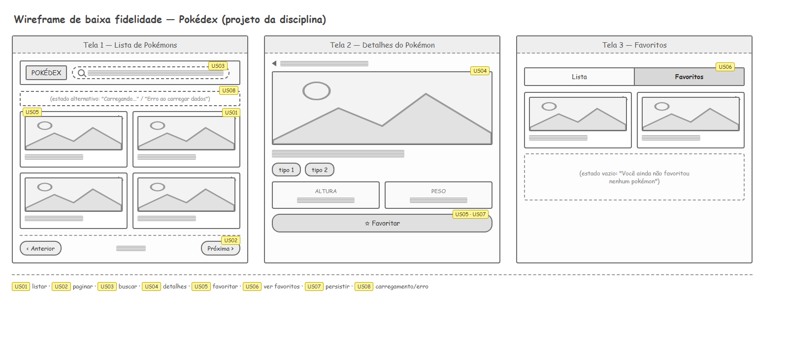

# Especificação de Funcionalidades — Projeto da Disciplina

[Desenvolvimento Web](../README.md) > [Projeto](projeto.md) > Especificação de Funcionalidades

Este documento reúne tudo o que define o comportamento da Pokédex:

- **Histórias de usuário** — o que a aplicação faz, contado na voz de quem usa (`Como [persona], quero [ação], para [benefício]`), cada uma com seus **critérios de aceite**: condições objetivas e testáveis para considerar a funcionalidade pronta.
- **Requisitos não funcionais (RNF)** — como a aplicação deve se comportar. São qualidades que atravessam várias histórias de usuário em vez de uma ação isolada — "o padrão que ela mantém enquanto faz", não "o que ela faz".

Persona única considerada: **visitante** — qualquer pessoa que abre a aplicação, sem cadastro ou login.

---

## 1. Diagrama de caso de uso

O diagrama abaixo mostra, de forma visual, tudo o que o visitante pode fazer na Pokédex. As setas tracejadas `«include»` indicam uma ação que acontece automaticamente junto de outra — por exemplo, toda vez que o visitante favorita algo, o sistema persiste isso em `localStorage` sem que seja uma ação separada.

*Código-fonte do diagrama: [`diagramas/01-caso-de-uso.mmd`](diagramas/01-caso-de-uso.mmd)*

---

## 2. Wireframe de baixa fidelidade

Rascunho visual das três telas principais da aplicação (Lista, Detalhes e Favoritos), com cada elemento anotado com o ID da história de usuário que ele atende.

> [!NOTE]
> Um **protótipo de baixa fidelidade** (wireframe) é um rascunho simplificado da interface — formas, caixas e textos de preenchimento no lugar de cores, fontes e conteúdo reais. Ele serve para validar rapidamente **onde** cada elemento fica e **como as telas se conectam**, antes de investir tempo em estilização (CSS) ou conteúdo definitivo. Não é a aparência final da aplicação.

---

## 3. Visão geral

| ID | História de usuário | Resumo |
|---|---|---|
| [US01](#us01--listar-pokémons) | Listar pokémons | Exibir uma lista de pokémons vinda da PokeAPI |
| [US02](#us02--paginar-a-lista) | Paginar a lista | Navegar entre páginas de pokémons |
| [US03](#us03--buscar-pokémon-por-nome) | Buscar pokémon por nome | Encontrar um pokémon específico digitando o nome |
| [US04](#us04--ver-detalhes-de-um-pokémon) | Ver detalhes de um pokémon | Exibir tipo, altura e peso ao selecionar um pokémon |
| [US05](#us05--favoritar-e-desfavoritar) | Favoritar e desfavoritar | Marcar/desmarcar um pokémon como favorito |
| [US06](#us06--visualizar-lista-de-favoritos) | Visualizar lista de favoritos | Mostrar só os pokémons favoritados |
| [US07](#us07--persistir-favoritos-entre-sessões) | Persistir favoritos entre sessões | Manter favoritos salvos em `localStorage` |
| [US08](#us08--feedback-de-carregamento-e-erro) | Feedback de carregamento e erro | Indicar carregamento e falhas de requisição |

| ID | Requisito não funcional | Resumo |
|---|---|---|
| [RNF01](#rnf01--responsividade) | Responsividade | Adaptar-se a diferentes tamanhos de tela |
| [RNF02](#rnf02--compatibilidade-de-navegador) | Compatibilidade de navegador | Funcionar em Chrome, Firefox e Edge |
| [RNF03](#rnf03--desempenho-percebido) | Desempenho percebido | Não travar a interface durante requisições |
| [RNF04](#rnf04--persistência-100-client-side) | Persistência 100% client-side | Funcionar sem servidor ou banco de dados próprio |
| [RNF05](#rnf05--legibilidade-e-manutenibilidade-do-código) | Legibilidade e manutenibilidade do código | Nomenclatura clara em variáveis, funções e classes |
| [RNF06](#rnf06--acessibilidade-básica) | Acessibilidade básica | Tags semânticas, `alt` descritivo, headings corretos |

---

## 4. Histórias de usuário

> [!NOTE]
> Uma **história de usuário** descreve uma funcionalidade pela perspectiva de quem usa a aplicação, não pela perspectiva técnica de "o que o sistema faz". Ela segue um padrão de escrita fixo: **"Como [persona], quero [ação], para [benefício]"** — persona identifica quem realiza a ação, ação é o que essa pessoa faz na aplicação, e benefício é o motivo, o valor que essa ação traz para ela. Escrever nesse formato obriga a sempre justificar o *porquê* de uma funcionalidade existir, não só o *o quê*.

### US01 — Listar pokémons

> Como visitante, quero ver uma lista de pokémons com nome e imagem, para explorar rapidamente quais pokémons existem.

**Critérios de aceite**
- Ao carregar a página, uma lista de pokémons aparece na tela sem exigir nenhuma ação do usuário.
- Cada item da lista mostra pelo menos nome e imagem (sprite).

---

### US02 — Paginar a lista

> Como visitante, quero navegar entre páginas da lista, para ver pokémons além dos primeiros exibidos sem precisar rolar uma lista enorme.

**Critérios de aceite**
- Existem controles ("anterior"/"próximo") que trocam o conjunto de pokémons exibido, usando os campos `next`/`previous` da PokeAPI.
- O botão "anterior" fica desabilitado ou oculto na primeira página, e o "próximo" na última.

---

### US03 — Buscar pokémon por nome

> Como visitante, quero buscar um pokémon pelo nome, para encontrá-lo diretamente sem navegar página por página.

**Critérios de aceite**
- Um campo de busca aceita texto e retorna o pokémon correspondente ao confirmar.
- Buscar um nome inexistente informa que nada foi encontrado, em vez de travar ou falhar silenciosamente.

---

### US04 — Ver detalhes de um pokémon

> Como visitante, quero ver mais informações de um pokémon (tipo, altura, peso), para decidir se ele é interessante antes de favoritá-lo.

**Critérios de aceite**
- Selecionar um pokémon da lista exibe tipo, altura e peso, buscando o endpoint individual da PokeAPI.
- É possível voltar da tela de detalhes para a lista sem recarregar a página.

---

### US05 — Favoritar e desfavoritar

> Como visitante, quero marcar pokémons como favoritos, para separar os que mais gosto do restante da lista.

**Critérios de aceite**
- Cada pokémon tem um controle visível (ex.: ícone de estrela/coração) que alterna seu estado de favorito.
- O estado (favoritado ou não) muda visualmente de forma imediata e clara, sem precisar de explicação.

---

### US06 — Visualizar lista de favoritos

> Como visitante, quero uma área só com meus pokémons favoritos, para revisá-los sem precisar procurar entre todos os pokémons.

**Critérios de aceite**
- Existe uma área/aba dedicada, separada da listagem geral.
- Ela mostra exatamente os pokémons marcados em US05, e nenhum outro.

---

### US07 — Persistir favoritos entre sessões

> Como visitante, quero que meus favoritos continuem salvos mesmo depois de fechar o navegador, para não ter que marcá-los de novo toda vez que eu voltar.

**Critérios de aceite**
- Favoritos são salvos em `localStorage` a cada alteração.
- Favoritos marcados permanecem após recarregar a página (F5) e após fechar e reabrir o navegador.

---

### US08 — Feedback de carregamento e erro

> Como visitante, quero saber quando a aplicação está buscando dados ou quando algo falhou, para não achar que a página travou ou está quebrada.

**Critérios de aceite**
- Uma mensagem de carregamento fica visível enquanto uma requisição à API está em andamento.
- Uma mensagem de erro fica visível caso a API não responda ou responda com falha.

---

## 5. Requisitos não funcionais

> [!NOTE]
> Um **requisito não funcional** descreve uma *qualidade* que a aplicação deve ter, não uma ação que ela executa. Enquanto uma história de usuário responde "o que a aplicação faz" (ex.: listar pokémons), um requisito não funcional responde "como ela deve se comportar enquanto faz isso" (ex.: continuar responsiva, funcionar em diferentes navegadores, não travar durante uma requisição). Por isso um único RNF costuma valer para várias histórias de usuário ao mesmo tempo, em vez de estar amarrado a uma só.

### RNF01 — Responsividade

A interface deve se adaptar a diferentes tamanhos de tela (celular, tablet, desktop), sem quebrar layout ou cortar conteúdo.

**Critério de aceite:** a lista de pokémons e a área de favoritos permanecem legíveis e utilizáveis em uma largura de tela de 360px (celular) até 1920px (desktop).

> [!NOTE]
> Este requisito se apoia diretamente nas aulas de Flexbox e Grid (6º e 7º encontros) e nas media queries vistas junto com responsividade mobile-first.

### RNF02 — Compatibilidade de navegador

A aplicação deve funcionar corretamente nas versões atuais dos navegadores mais usados (Chrome, Firefox, Edge), sem depender de recursos experimentais ou exclusivos de um único navegador.

**Critério de aceite:** todas as funcionalidades (US01–US08) funcionam de forma idêntica testando manualmente em pelo menos dois navegadores diferentes.

### RNF03 — Desempenho percebido

Requisições à PokeAPI não podem travar a interface: a página continua respondendo (scroll, cliques) enquanto uma requisição está em andamento.

**Critério de aceite:** durante o carregamento de dados (US08), é possível interagir com outros elementos já renderizados da página sem travamento perceptível.

### RNF04 — Persistência 100% client-side

A aplicação não deve depender de nenhum servidor ou banco de dados próprio — os favoritos vivem inteiramente no `localStorage` do navegador.

**Critério de aceite:** a aplicação funciona por completo (exceto a listagem de pokémons, que depende da PokeAPI) sendo aberta como arquivo estático, sem nenhum back-end rodando localmente.

### RNF05 — Legibilidade e manutenibilidade do código

Nomes de variáveis, funções e classes CSS devem revelar claramente sua intenção e papel no sistema (ex.: `favoritarPokemon`, não `f1`), seguindo PascalCase/camelCase conforme o contexto.

**Critério de aceite:** o código pode ser lido e explicado por outra pessoa (ou pelo professor) sem exigir que o autor descreva verbalmente o que cada função faz.

> [!IMPORTANT]
> Este requisito é a base do critério **"Boas práticas de programação"** da [rubrica avaliativa](../roadmap/roadmap.md#4-rubrica-avaliativa-dos-trabalhos) (20% da nota de cada trabalho).

### RNF06 — Acessibilidade básica

A estrutura HTML deve seguir as práticas de acessibilidade vistas na aula-03: tags semânticas em vez de `
` genéricas, `alt` descritivo em toda imagem informativa, e um único `<h1>` por página.

**Critério de aceite:** inspecionando a aba **Accessibility** do DevTools (ou navegando com leitor de tela), as landmarks esperadas (`banner`, `navigation`, `main`, `contentinfo`) aparecem corretamente, e nenhuma `` relevante está sem `alt`.

---

## 6. Rastreabilidade

Os requisitos não funcionais (seção 5) se aplicam transversalmente a todas as histórias de usuário (seção 4) — nenhum RNF pertence a uma única US em particular.
