# Roadmap — Desenvolvimento Web 1

**Curso:** Engenharia de Software e Análise e Desenvolvimento de Sistemas
**Produto/Artefato do Saber:** Aplicação web funcional (front-end e back-end) que consome APIs externas e uma API própria desenvolvida pelo aluno.

---

## 1. Cronograma

| Encontro | Conteúdo |
|---|---|
| 1º | Internet, cliente-servidor, navegador e URL. Lógica computacional: variáveis, tipos de dados e operadores. |
| 2º | Estruturas condicionais e de repetição (`if/else`, `for`, `while`) e funções básicas. |
| 3º | Estrutura de documento HTML5, tags semânticas (`header`, `main`, `section`, `footer`) e acessibilidade. |
| 4º | Formulários, inputs, tabelas, mídia (`img`, `audio`, `video`) e validação nativa HTML5. |
| 5º | CSS: seletores, box model, cores, tipografia e unidades de medida. |
| 6º | Flexbox: layout unidimensional, alinhamento e distribuição de elementos. |
| 7º | CSS Grid e responsividade (media queries, mobile-first). |
| 8º | JavaScript no navegador: sintaxe, `let`/`const`, escopo. Funções de alta ordem (`map`, `filter`, `reduce`) e closures. |
| 9º | DOM: seleção de elementos e eventos. Arrays e objetos em JavaScript. **🏁 1ª Entrega do projeto.** |
| 10º | Apresentação de trabalho 1 — checkpoint intermediário do projeto. |
| 11º | Prova 1 — lógica computacional, HTML, CSS e fundamentos de JavaScript. |
| 12º | Protocolo HTTP/HTTPS, métodos (`GET`, `POST`, `PUT`, `PATCH`, `DELETE`), status codes e princípios REST. |
| 13º | JSON: sintaxe, `JSON.parse`/`stringify`. |
| 14º | Consumo de APIs com `fetch()`: requisições GET e exibição de dados na tela. |
| 15º | Comunicação síncrona x assíncrona: event loop, call stack e callbacks. |
| 16º | Promises, `async`/`await`, tratamento de erros e `Promise.all`. |
| 17º | Node.js e Express: criação de endpoints (`GET`/`POST`) retornando JSON. |
| 18º | Boas práticas: Git/GitHub, variáveis de ambiente, CORS e noções de autenticação. **🏁 Entrega Final do projeto.** |
| 19º | Apresentação de trabalho 2 (final) — projeto completo. |
| 20º | Prova 2 — HTTP, JSON, consumo de APIs e assincronismo. Encerramento da disciplina. |

Material já publicado: [`aula-01/aula-01.md`](../aula-01/aula-01.md) e [`aula-02/aula-02.md`](../aula-02/aula-02.md).

---

## 2. Diagrama do cronograma

```mermaid
%%{init: {'theme':'base', 'themeVariables': {
  'primaryColor': '#378ADD',
  'primaryTextColor': '#FFFFFF',
  'primaryBorderColor': '#185FA5',
  'secondaryColor': '#D85A30',
  'secondaryTextColor': '#FFFFFF',
  'tertiaryTextColor': '#2C2C2A',
  'lineColor': '#5F5E5A',
  'textColor': '#2C2C2A'
}}}%%
flowchart TD
    n1["1º — Internet e lógica computacional"]:::padrao
    n2["2º — Condicionais e repetição"]:::padrao
    n3["3º — HTML5 semântico"]:::padrao
    n4["4º — Formulários e mídia"]:::padrao
    n5["5º — CSS básico"]:::padrao
    n6["6º — Flexbox"]:::padrao
    n7["7º — CSS Grid"]:::padrao
    n8["8º — JS no navegador"]:::padrao
    n9["9º — 🏆 Trabalho 1 (entrega)"]:::trabalho
    n10["10º — 🏆 Trabalho 1 (apresentação)"]:::trabalho
    n11["11º — 📝 Prova 1"]:::prova
    n12["12º — Protocolo HTTP"]:::padrao
    n13["13º — JSON"]:::padrao
    n14["14º — fetch() e consumo de API"]:::padrao
    n15["15º — Event loop e callbacks"]:::padrao
    n16["16º — Promises e async/await"]:::padrao
    n17["17º — Node.js e Express"]:::padrao
    n18["18º — 🏆 Trabalho 2 (entrega final)"]:::trabalho
    n19["19º — 🏆 Trabalho 2 (apresentação)"]:::trabalho
    n20["20º — 📝 Prova 2"]:::prova

    n1 --> n2 --> n3 --> n4 --> n5 --> n6 --> n7 --> n8 --> n9 --> n10 --> n11 --> n12 --> n13 --> n14 --> n15 --> n16 --> n17 --> n18 --> n19 --> n20

    classDef padrao fill:#EDEDEB,color:#2C2C2A,stroke:#C9C8C2,stroke-width:1px;
    classDef trabalho fill:#378ADD,color:#FFFFFF,stroke:#185FA5,stroke-width:2px;
    classDef prova fill:#D85A30,color:#FFFFFF,stroke:#A8431F,stroke-width:2px;
```

🔵 Trabalho (projeto) · 🟠 Prova

---

## 3. Composição da nota final

| Avaliação | Peso na nota final |
|---|---|
| 🔵 2 Trabalhos (Trabalho 1 e Trabalho 2) | 40% |
| 🟠 2 Provas (Prova 1 e Prova 2) | 60% |

---

## 4. Rubrica avaliativa (dos trabalhos)

Cada um dos dois trabalhos do projeto é avaliado segundo os quatro critérios abaixo:

| Critério | Descrição | Peso |
|---|---|---|
| **Entrega no prazo** | Cumprimento do cronograma, organização dos arquivos e pontualidade na submissão. | 10% |
| **Boas práticas de programação** | PascalCase, camelCase, nomenclaturas que revelem claramente sua intenção, significado e papel dentro do sistema. | 20% |
| **Engajamento** | O aluno demonstra clareza e domínio ao explicar a lógica do programa, por que escolheu determinada lógica de validação ou nome de método, e participação em sala de aula (ex.: elaboração de exercícios). | 30% |
| **Competências técnicas** | Avalia o domínio dos princípios fundamentais do conteúdo passado em sala por meio da implementação assertiva da solução do problema proposto. | 40% |
