# Roadmap — Desenvolvimento Web

**Curso:** Engenharia de Software e Análise e Desenvolvimento de Sistemas

**Produto/Artefato do Saber:** Aplicação web funcional (front-end) que consome APIs externas.

---

## 1. Cronograma

| Encontro | Conteúdo | Material |
|---|---|--------------------------------------------|
| 1º | Internet, cliente-servidor, navegador e URL. Lógica computacional: variáveis, tipos de dados (strings, números, booleanos) e operadores. | [`aula-01.md`](../aula-01/aula-01.md) |
| 2º | Estruturas condicionais e de repetição (`if/else`, `for`, `while`) e funções básicas. | [`aula-02.md`](../aula-02/aula-02.md) |
| 3º | Estrutura de documento HTML5, tags semânticas (`header`, `main`, `section`, `footer`) e acessibilidade. | *A publicar* |
| 4º | Formulários, inputs, tabelas, mídia (`img`, `audio`, `video`) e validação nativa HTML5. | *A publicar* |
| 5º | CSS: seletores, box model, cores, tipografia e unidades de medida. | *A publicar* |
| 6º | Flexbox: layout unidimensional, alinhamento e distribuição de elementos. Prática com o jogo [Flexbox Froggy](https://flexboxfroggy.com/). | *A publicar* |
| 7º | CSS Grid e responsividade (media queries, mobile-first). | *A publicar* |
| 8º | JavaScript no navegador: sintaxe, `let`/`const`, escopo. Funções de alta ordem (`map`, `filter`, `reduce`) e closures. | *A publicar* |
| 9º | Aprofundamento de JavaScript: escopo e closures na prática, funções de alta ordem combinadas (`map`, `filter`, `reduce` encadeados) e desestruturação. DOM: seleção de elementos e eventos. Arrays e objetos em JavaScript. | *A publicar* |
| 10º | Apresentação de trabalho 1 — checkpoint intermediário do projeto. | *A publicar* |
| 11º | Prova 1 — lógica computacional, HTML, CSS e fundamentos de JavaScript. | *A publicar* |
| 12º | Protocolo HTTP/HTTPS, métodos (`GET`, `POST`, `PUT`, `PATCH`, `DELETE`), status codes e princípios REST. | *A publicar* |
| 13º | JSON: sintaxe, `JSON.parse`/`stringify`. Persistência de dados no navegador com `localStorage`. | *A publicar* |
| 14º | Consumo de APIs com `fetch()`: requisições GET e exibição de dados na tela. | *A publicar* |
| 15º | Comunicação síncrona x assíncrona: event loop, call stack e callbacks. | *A publicar* |
| 16º | Promises, `async`/`await`, tratamento de erros e `Promise.all`. | *A publicar* |
| 17º | Aprofundamento de Promises e `async`/`await`: encadeamento de promises, `Promise.all` e `Promise.allSettled`, cancelamento de requisições (`AbortController`) e nova tentativa automática após falha (retry). | *A publicar* |
| 18º | Laboratório de finalização do projeto: revisão geral do conteúdo do semestre e trabalho supervisionado para testar, corrigir e polir a aplicação. **🏁 Entrega Final do projeto.** | *A publicar* |
| 19º | Apresentação de trabalho 2 (final) — projeto completo. | *A publicar* |
| 20º | Prova 2 — HTTP, JSON, consumo de APIs e assincronismo. Encerramento da disciplina. | *A publicar* |

---

## 2. Diagrama do cronograma

*Código-fonte do diagrama: [`diagramas/01-cronograma.mmd`](diagramas/01-cronograma.mmd)*

🔵 Trabalho (projeto) · 🟠 Prova

---

## 3. Composição da nota final

| Avaliação | Peso na nota final |
|---|---|
| 🔵 2 Trabalhos (Trabalho 1 e Trabalho 2) | 40% |
| 🟠 2 Provas (Prova 1 e Prova 2) | 60% |

---

## 4. Rubrica avaliativa (dos trabalhos)

Cada um dos dois trabalhos do projeto é avaliado segundo os quatro critérios abaixo:

| Critério | Descrição | Peso |
|---|---|---|
| **Entrega no prazo** | Cumprimento do cronograma, organização dos arquivos e pontualidade na submissão. | 10% |
| **Boas práticas de programação** | PascalCase, camelCase, nomenclaturas que revelem claramente sua intenção, significado e papel dentro do sistema. | 20% |
| **Engajamento** | O aluno demonstra clareza e domínio ao explicar a lógica do programa, por que escolheu determinada lógica de validação ou nome de método, e participação em sala de aula (ex.: elaboração de exercícios). | 30% |
| **Competências técnicas** | Avalia o domínio dos princípios fundamentais do conteúdo passado em sala por meio da implementação assertiva da solução do problema proposto. | 40% |
